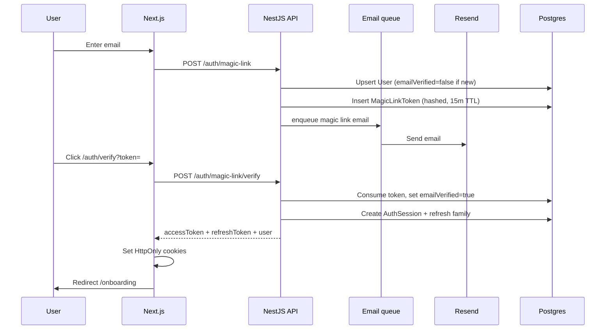
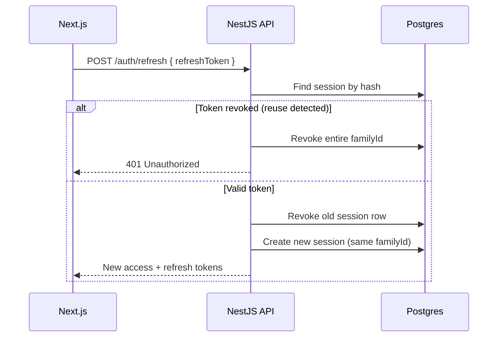
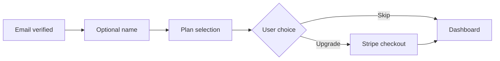
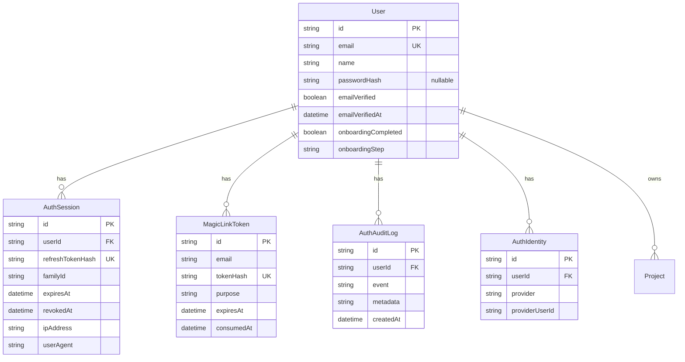

# Arco Authentication Architecture

NestJS-owned authentication with mandatory email verification, passwordless magic links as the primary method, optional password fallback, JWT access tokens, rotating refresh tokens, and progressive onboarding.

## Decision summary

| Concern | Choice |
|---------|--------|
| Authority | **NestJS API** — single `User` table in Postgres |
| Primary auth | Magic link via **Resend** |
| Fallback auth | Optional password (bcrypt, 12 rounds) |
| Sessions | DB-backed refresh tokens with rotation + reuse detection |
| Web session | HttpOnly cookies set by Next.js after API token exchange |
| Access token | Stateless JWT (15 min), validated on every API request |
| Scale path | Redis-backed rate limits + email queue (interface ready) |
| SSO future | `AuthIdentity` model + `OAuthProvider` interface |

---

## Flow diagrams

### Signup / login (magic link — primary)



### Refresh token rotation



### Progressive onboarding



---

## Database schema



---

## API endpoints

Base: `http://localhost:8000/api`

### Public

| Method | Path | Body | Response |
|--------|------|------|----------|
| POST | `/auth/magic-link` | `{ email }` | `{ sent, purpose?, devVerifyUrl? }` |
| POST | `/auth/magic-link/verify` | `{ token }` | `AuthTokensResponse` |
| POST | `/auth/register` | `{ email, password }` | `{ sent, message, devVerifyUrl? }` |
| POST | `/auth/login` | `{ email, password }` | `AuthTokensResponse` |
| POST | `/auth/refresh` | `{ refreshToken }` | `AuthTokensResponse` |
| POST | `/auth/logout` | `{ refreshToken }` | `{ success }` |
| POST | `/auth/password/forgot` | `{ email }` | `{ sent, message }` |
| POST | `/auth/password/reset` | `{ token, password }` | `{ success }` |

### Authenticated (Bearer or cookie)

| Method | Path | Description |
|--------|------|-------------|
| GET | `/auth/sessions` | List active sessions |
| DELETE | `/auth/sessions/:id` | Revoke session |
| POST | `/auth/logout-all` | Revoke all other sessions |
| POST | `/auth/password/set` | Set password for magic-link-only users |
| PATCH | `/auth/onboarding` | `{ name?, step? }` |
| GET | `/users/me` | Current user profile |
| PATCH | `/users/me` | Update profile |

### AuthTokensResponse

```json
{
  "accessToken": "eyJ...",
  "refreshToken": "opaque-base64url",
  "expiresIn": 900,
  "tokenType": "Bearer",
  "user": {
    "id": "cuid",
    "email": "user@company.com",
    "name": null,
    "emailVerified": true,
    "onboardingCompleted": false,
    "onboardingStep": "plan"
  }
}
```

---

## Session and token strategy

| Token | Type | TTL | Storage | Transport |
|-------|------|-----|---------|-----------|
| Access | JWT (`sub`, `email`, `sid`, `type: access`) | 15 min | Not stored (stateless) | HttpOnly cookie + Bearer header |
| Refresh | Opaque random (SHA-256 hash in DB) | 30 days | `AuthSession` table | HttpOnly cookie |
| Magic link | Opaque random (SHA-256 hash in DB) | 15 min | `MagicLinkToken` table | Email URL only |

**Rotation:** Each refresh invalidates the previous refresh token and issues a new one within the same `familyId`. Presenting a revoked refresh token revokes the entire family (theft detection).

**Multi-device:** Each login creates a new `familyId`. Users manage devices via Settings → Security.

---

## Security

| Threat | Mitigation |
|--------|------------|
| Token theft | HttpOnly + Secure + SameSite=Lax cookies; short access TTL |
| Refresh reuse | Family revocation on reuse detection |
| Brute force | Rate limits per IP/email on magic link, login, refresh |
| User enumeration | Password reset always returns success message |
| Magic link replay | Single-use tokens, hashed at rest |
| XSS | No tokens in localStorage; access token not exposed to JS unless via server session endpoint |
| CSRF | SameSite cookies; state-changing auth uses POST + server actions |
| Suspicious login | Device fingerprint change triggers audit log + email alert |

Audit events are written asynchronously to `AuthAuditLog`.

---

## Scalability and HA

| Component | Current | Production recommendation |
|-----------|---------|---------------------------|
| Rate limiting | In-process `Map` | Redis sliding window |
| Email delivery | In-process queue (`setImmediate`) | BullMQ / SQS + Resend |
| Audit logs | Async Postgres writes | Dedicated audit table + log drain |
| JWT validation | Stateless (any API instance) | Same — no sticky sessions required |
| Refresh sessions | Postgres | Postgres + read replicas |
| Magic links | Postgres | Postgres; optional Redis for hot path |

Run multiple NestJS instances behind a load balancer. No session affinity required for access tokens. Refresh rotation uses DB transactions for correctness.

---

## Environment variables

### API (`apps/api/.env`)

```
JWT_SECRET=           # Shared with web middleware
RESEND_API_KEY=
EMAIL_FROM=Arco <hello@arco.app>
WEB_APP_URL=http://localhost:3000
DATABASE_URL=
CORS_ORIGIN=http://localhost:3000
```

### Web (`apps/web/.env.local`)

```
JWT_SECRET=           # Must match API
API_URL=http://localhost:8000/api
```

---

## Implementation map

```
apps/api/src/auth/
  auth.controller.ts       # HTTP endpoints
  auth.service.ts          # Orchestration
  services/
    token.service.ts       # JWT access tokens
    session.service.ts     # Refresh rotation
    magic-link.service.ts  # Link create/consume
    audit.service.ts       # Async audit logs
    rate-limit.service.ts  # Sliding window (Redis-ready)
    email-queue.service.ts # Async Resend delivery
  providers/
    oauth-provider.interface.ts  # Future SSO
```

```
apps/web/src/lib/auth/
  cookies.ts    # HttpOnly cookie helpers
  session.ts    # getServerSession(), refresh
  constants.ts
```

---

## Onboarding UX

1. **Signup:** email only (magic link) or email + password — no name, company, or plan required
2. **Verify:** mandatory email click before session is issued
3. **Onboarding step 1:** optional name (skippable)
4. **Onboarding step 2:** plan selection — upgrade via Stripe or continue free to dashboard
5. **Profile completion:** available anytime in Settings

---

## Migration notes

- Removed NextAuth, `.data/users.json`, and dual-token bridge
- `passwordHash` is now optional on `User`
- Run `pnpm --filter @arco/api db:push` after pulling
- Existing password users must verify email if `emailVerified` is false (default for legacy rows — set manually or re-verify)
