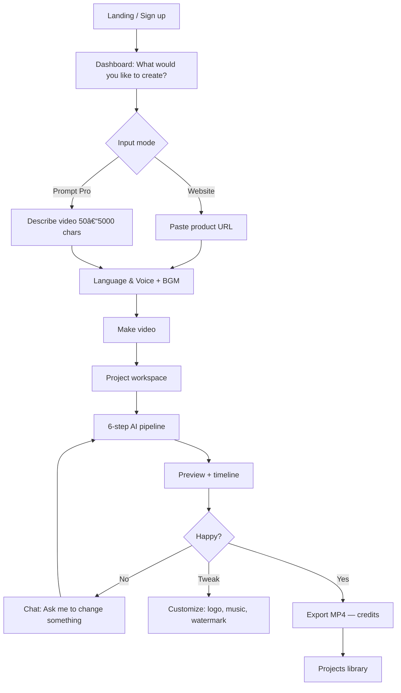
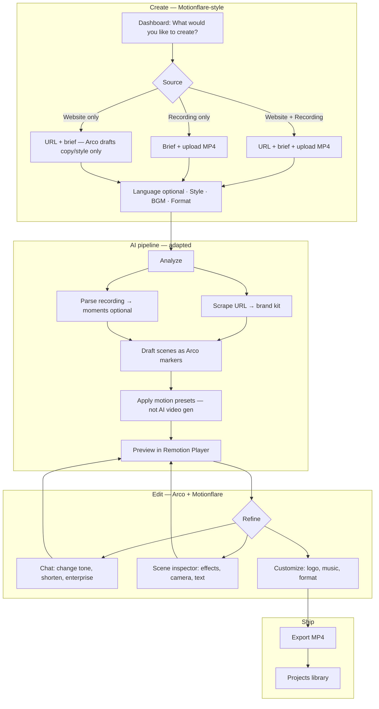

# Motionflare.ai — reference & combined Arco MVP

**Source:** [motionflare.ai/features](https://motionflare.ai/features) (June 2026).

**Formerly:** [LaunchVideo.app](https://launchvideo.app) — same product, rebranded to Motionflare.

**Purpose:** Document Motionflare’s full flow and user journey as the **cost model** for Arco. **Target result quality = Motion.so** (studio motion design). **Cost path = Motionflare-style pipeline** (URL/screenshots → storyboard → TTS → Remotion presets — not generative video). Recording is secondary; real UI screenshots are the visual source of truth. See [DECISIONS.md](./DECISIONS.md).

---

## What Motionflare is

> “URL in. Video out.” — No screen recorder. No editor. Just a URL.

**Input:** Product URL **or** text prompt (Pro).  
**Output:** ~30–76s motion video with AI voiceover, generated/animated scenes, brand styling, MP4 export.  
**No user screen recording** — visuals are AI-generated from website scrape + scene prompts.

Landing tagline: “Turn any website into studio-quality Motion Video.”

---

## Full user journey



---

## Screen-by-screen flow

### 1. Landing (`/`)

| Element | Detail |
|---------|--------|
| Hero | “Turn any website into studio-quality Motion Video” |
| Sub | “Ship in 60 seconds to X, YouTube, or Product Hunt” |
| CTA | Same creation box as dashboard — Website tab + URL input |
| Examples | Cursor, ElevenLabs, Framer, Linear, Notion, etc. |
| Demo | Inline video player with example output |
| Features | **Paste** · **Sound** · **Read** · **Preview** · **Share** |

**Journey:** Visitor can paste URL on landing → sign up → generate (or sign up first).

---

### 2. Dashboard (`/dashboard`)

**Headline:** “What would you like to create?”

#### Tab A — Website (free tier)

| Field | Detail |
|-------|--------|
| Product URL | Landing page, blog, any public URL |
| Language & Voice | e.g. English/EN — accent + TTS voice |
| BGM | Background music picker (None default) |
| Make video | Enabled when URL valid |

#### Tab B — Prompt (Pro)

| Field | Detail |
|-------|--------|
| Describe your video | 50–5000 chars — “Describe your idea, Motionflare will bring it to life…” |
| Style | Auto (and other presets) |
| Language & Voice | Same as Website |
| BGM | Same |
| Make video Pro | Requires Pro plan |

**Sidebar:** Dashboard · Projects · Subscription · Contact · Quick Tutorial · Upgrade

---

### 3. Generation workspace (`/project/:id`)

Split layout: **AI chat (left)** + **Preview & scenes (right)**.

#### Left — conversational agent

1. User message auto-sent: *“Make me a video for {url}”*
2. Agent streams status with timing:
   - **Analyzing your product** (~27s)
     - Page content (char count)
     - Screenshot thumbnail
     - Brand style (font, energy, audience)
   - **Drafting scenes** — “11 scenes, 30s target”
   - **Recording voice-over** (~40s) — per-scene TTS
   - **Preparing logo**
   - **Designing layout**
   - **Animating every scene** (~145s) — per-scene render + **Regenerate** per scene
   - **Stitching together**
   - “Your video is ready”
3. Chat input becomes: **“Ask me to change something…”**

#### Right — 6-step pipeline stepper

| Step | What happens |
|------|----------------|
| **Analyze** | Fetch page → read content → extract brand |
| **Draft** | Scene list: visual prompt + VO script + duration per scene |
| **Voice** | TTS for each scene (e.g. “Aoede”, “Warm - en”) |
| **Layout** | Typography, colors, composition rules |
| **Scenes** | Render each scene (AI video/graphics) |
| **Combine** | Stitch clips + audio → final preview |

#### Scene model (each scene)

```typescript
{
  index: 1,
  durationSec: 4.6,
  visualPrompt: "Close-up UI showing the Agent assignment dropdown…",
  voScript: "That is why Linear connects human builders with AI agents.",
  headline?: "Connect human builders with AI agents",
  status: "ready" | "generating",
  regenerate: true
}
```

#### Preview (when ready)

| Control | Detail |
|---------|--------|
| Video player | Play, mute, fullscreen |
| Timeline | 11 clip thumbnails + VO waveform track + BGM track |
| Mute VO | Toggle voiceover |
| Pick BGM | Per-project soundtrack |
| CTA button | e.g. “Run on Linear” (end-card CTA from site) |

#### Customize modal

| Setting | Detail |
|---------|--------|
| Logo | Upload PNG/JPG/SVG/WebP — shown on all scenes |
| Background music | Track picker |
| Watermark | Toggle motionflare.ai badge (Pro removes) |

#### Export

| Option | Credits |
|--------|---------|
| 1080p 30fps | 3 |
| 1080p 60fps | 3 |
| 4K 30fps | 8 |
| 4K 60fps | 8 |

Format: MP4 (H.264). Button: **Export Video (N credits)**.

---

### 4. Projects (`/projects`)

| Element | Detail |
|---------|--------|
| List | Thumbnail, title, source URL, Ready status, time ago |
| Search | Filter projects |
| New Project | → Dashboard create flow |
| Open | → Project workspace |

---

### 5. Subscription (`/subscription`)

#### Credits

- Available credits (subscription + pack)
- Pack credits never expire
- Pipeline pre-deducts credits per scene count

#### Plans

| Plan | Price | Highlights |
|------|-------|------------|
| **Free** | $0 | 15 signup credits, 1 project, 1080p **with watermark** |
| **Pro** | Paid | 100/mo credits, unlimited projects, 1080p/4K no watermark, **Prompt mode**, private share, multi-language, upload BGM |
| **Max** | Paid | 300/mo credits, same Pro features |

#### Credit pack

- 50 credits — $15

---

## Motionflare feature inventory

| Category | Features |
|----------|----------|
| **Input** | URL scrape, Prompt (Pro), example brands |
| **AI pipeline** | Analyze → Draft → Voice → Layout → Scenes → Combine |
| **Brand** | Auto-extract colors, font, logo, energy from URL |
| **Audio** | TTS voiceover (multi accent), BGM library, upload BGM (Pro) |
| **Visuals** | AI-generated scenes (not user recording) |
| **Edit** | Chat refinements, per-scene regenerate, customize logo/music |
| **Preview** | Inline player + multi-track timeline |
| **Export** | 1080p/4K MP4, credit-based |
| **Monetize** | Free/Pro/Max + credit packs, watermark on free |

---

## Arco vs Motionflare

| Dimension | Motionflare | Arco (today) | Arco advantage |
|-----------|-------------|--------------|----------------|
| **Primary input** | URL or prompt | Screen recording | **Real product UI** — no hallucinated screens |
| **Visual source** | AI-generated scenes | User’s actual recording | Authentic demos founders trust |
| **Motion** | AI video gen per scene | Preset zoom/ripple/title on real footage | Deterministic, editable, faster render |
| **Voice** | Full TTS voiceover | None (MVP) | Motionflare wins on “talking launch video” |
| **Brand from URL** | Deep scrape + style | Planned | Adopt their analyze step |
| **Creation UX** | One box → auto pipeline | Multi-step wizard | Adopt their simplicity |
| **Edit UX** | Chat + regenerate scene | Marker inspector | **Combine both** |
| **Export** | Working, credits | Stub | Must ship |
| **Trust** | “Feels like your site” via scrape | “Is your site” via recording | **Core positioning** |

**Arco positioning (combined):**

> Motionflare makes videos *about* your product from a URL.  
> **Arco makes videos *of* your product** — real recordings — with Motionflare-grade AI for brief, brand, copy, and scene planning.

---

## Combined Arco MVP — unified flow

Merge Motionflare’s **creation simplicity + AI pipeline UX** with Arco’s **recording-first truth**.

### Unified user journey



### Step 0 — Entry (adopt from Motionflare)

Replace Arco’s fragmented “dashboard wizard” + separate `/editor` with **one dashboard create screen**:

- Headline: **“What would you like to create?”**
- Tabs:
  - **Website + Recording** (Arco default — differentiated)
  - **Recording** (no URL)
  - **Prompt** (Pro later — brief-only, still requires upload for MVP)
- Fields: Product URL (optional) · Brief textarea · Upload recording
- Options: Style preset · Export format · BGM · (Voice later)
- Example chips: same SaaS brands for demo
- **Make video** → creates project → opens workspace

### Step 1 — Analyze (combine)

| Motionflare step | Arco adaptation |
|------------------|-----------------|
| Fetch page | Scrape URL → OG, copy, screenshot, brand colors/font |
| Read content | LLM extracts value props, feature list, tone |
| Extract brand style | Map to `ArcoProject.brand` + `stylePreset` |
| *(missing in MF)* | **Analyze recording** — duration, optional frame labels |
| Output | `ProjectBrief` + brand kit + draft `Marker[]` |

**UI:** Left chat log (copy Motionflare) + right stepper: **Analyze → Draft → Motion → Preview → Export**

Skip Motionflare’s Voice/Layout/Scenes AI-gen steps for MVP; replace with **Motion** (apply presets to real recording).

### Step 2 — Draft (combine)

Motionflare drafts 11 scenes with visual prompt + VO. Arco drafts **markers** on the recording timeline:

| Motionflare scene field | Arco `Marker` field |
|-------------------------|---------------------|
| `voScript` | `callout.text` (+ optional subtext) |
| `headline` | `callout.text` or title-card |
| `visualPrompt` | `label` + suggested `clickEffect` / `focus` |
| `durationSec` | `durationMs` |
| scene index → time | `startMs` from recording analysis or evenly spaced |
| Regenerate | Per-marker AI regen |

**No AI-generated UI footage** — visual is always the user’s recording with motion presets applied.

### Step 3 — Preview (adopt from Motionflare)

| Feature | Arco MVP |
|---------|----------|
| Inline Remotion player | ✅ Already built |
| Scene strip / timeline | Add thumbnail strip like Motionflare |
| VO track | Phase 2 — Arco MVP uses text callouts only |
| BGM track | Wire `audio.musicId` |
| “Ready” badge | After first preview load |

### Step 4 — Edit (combine both)

| Mode | Source |
|------|--------|
| **Chat** | “Make headlines shorter”, “More technical”, “Add scene at 0:15” |
| **Inspector** | Arco scene settings — effects, camera, transitions |
| **Customize** | Logo, music, watermark, export format |
| **Regenerate scene** | Re-run AI for one marker’s copy + effects |

### Step 5 — Export (adopt from Motionflare)

| Feature | Arco MVP |
|---------|----------|
| Quality picker | 1080p 30fps minimum |
| Credit cost | Optional — can start without credits |
| MP4 download | Required |
| Share link | Phase 2 |

### Step 6 — Projects (adopt from Motionflare)

- `/projects` grid with thumbnail, title, status (Draft / Ready), source URL
- Search, New Project, open → workspace

---

## Combined feature checklist (MVP gate)

Use this as the **product** checklist — supersedes siloed Arco-only flow.

### Create (Motionflare UX)

- [ ] Single dashboard: “What would you like to create?”
- [ ] Product URL field
- [ ] Brief / describe textarea
- [ ] Screen recording upload (Arco differentiator)
- [ ] Style · Format · BGM options before generate
- [ ] Example brand chips
- [ ] Make video → project workspace

### AI pipeline (hybrid)

- [ ] URL scrape → brand kit (colors, logo, tone)
- [ ] LLM draft → `Marker[]` with callouts on recording timeline
- [ ] Chat log with timed steps (Analyze → Draft → Motion)
- [ ] Chat input: “Ask me to change something…”
- [ ] Per-scene regenerate
- [ ] Recording analysis (basic → advanced vision later)

### Motion & preview (Arco core)

- [ ] Real recording as video source (never AI fake UI)
- [ ] Presets: zoom, ripple, title, spotlight, transitions
- [ ] Remotion live preview
- [ ] Scene timeline strip
- [ ] Scene inspector for manual tweaks

### Customize & export

- [ ] Logo upload
- [ ] BGM picker + volume
- [ ] Export MP4 (1080p)
- [ ] Download from workspace
- [ ] Projects library with thumbnails

### Monetization (Motionflare model — phase 2)

- [ ] Credits per export — **Arco uses subscription export allowance, not credits** ([REFERENCE-MOTIONFLARE.md](./REFERENCE-MOTIONFLARE.md#part-2--what-to-borrow-and-avoid))
- [ ] Free watermark / Pro no watermark
- [ ] Prompt-only mode (Pro)

### Explicitly NOT in combined MVP

- [ ] AI-generated scene footage (Motionflare’s Scenes step)
- [ ] TTS voiceover (add Phase 2 if needed for parity)
- [ ] 4K export
- [ ] Public share links

---

## Implementation priority (combined)

1. **Dashboard create screen** — Motionflare layout + Arco upload
2. **Project workspace** — chat left + preview right (replace current journey screens)
3. **AI analyze + draft** — URL + brief → markers (replace mock)
4. **Connect API + S3 + persist**
5. **Export MP4**
6. **Projects grid**
7. Chat refine + per-scene regen
8. Voice/TTS (optional parity with Motionflare) — see [ROADMAP.md](./ROADMAP.md#part-3--screenshot--voice--music-initiative)

---

## Screenshot + voice + music (next initiative)

**Master plan:** [ROADMAP.md](./ROADMAP.md#part-3--screenshot--voice--music-initiative)

**UX + billing contrast:** [REFERENCE-MOTIONFLARE.md](./REFERENCE-MOTIONFLARE.md#part-2--what-to-borrow-and-avoid) — what to borrow from Motionflare, toolbox comparison, export-on-success policy.

Phases: **0** decisions/assets → **1** screenshots → **2** BGM library → **3** ElevenLabs → **4** custom upload → **5** hybrid polish.

---

## Related docs

- [REFERENCE-MOTIONFLARE.md](./REFERENCE-MOTIONFLARE.md#part-2--what-to-borrow-and-avoid)
- [ROADMAP.md](./ROADMAP.md#part-3--screenshot--voice--music-initiative)
- [STATUS.md](./STATUS.md#feature-checklist)
- [STATUS.md](./STATUS.md#engineering-checklist)
- [PRODUCT.md](./PRODUCT.md)
- [TECHNICAL.md](./TECHNICAL.md#prompts-and-style)

---

# Part 2 — What to borrow (and avoid)


**Purpose:** Capture UX and product ideas worth taking from [Motionflare](https://motionflare.ai/dashboard), contrast their [disclosed stack](https://motionflare.ai/privacy) with Arco’s, and document billing philosophy Arco intentionally rejects.

**Related:** [REFERENCE-MOTIONFLARE.md](./REFERENCE-MOTIONFLARE.md) · [ROADMAP.md](./ROADMAP.md#part-3--screenshot--voice--music-initiative) · [BUSINESS.md](./BUSINESS.md)

---

## Strategic stance

Motionflare’s **product UX and create flow** are strong. Their **output quality** often disappoints because visuals are **AI-generated or scraped**, not the user’s real product in motion.

> **Borrow their interface patterns. Do not borrow their visual pipeline or credit-metered generation.**

**Arco positioning:**

> Motionflare makes videos *about* your product from a URL.  
> **Arco makes videos *of* your product** — recordings and real screenshots — with Motionflare-grade create UX, voice, and music.

---

## Ideas to adopt (UX & product)

### Create surface

| Idea | Motionflare | Arco plan |
|------|-------------|-----------|
| “What would you like to create?” hero | ✅ | ✅ Shipped (`/dashboard`) |
| Input mode tabs | Website · Prompt | **Recording · Screenshots ·** (optional URL) |
| **Language & Voice** chip before generate | ✅ | Phase 3 — [roadmap](./SCREENSHOT-VOICE-MUSIC-ROADMAP.md) |
| **BGM** modal — library + preview + None | ✅ (Warm Launch, Up Bit, …) | Phase 2 |
| **Upload your BGM** (Pro) | ✅ | Phase 4 |
| Example brand chips (Cursor, Stripe, …) | ✅ | Add under create hero |
| Make video → workspace (not wizard pages) | ✅ | ✅ Shipped |

### BGM modal pattern (copy this UI)

Observed library tracks with mood tags and play buttons:

- Warm Launch (WARM)
- Bright Pulse (BRIGHT)
- Launch Drive (DRIVING)
- Calm Focus (STEADY)
- Mountain Rise (CINEMATIC)
- **Up Bit** (UPBEAT)

Arco should match: **None**, grid with **mood tag + duration + play preview**, optional Pro upload.

### Generation workspace

| Idea | Adopt? |
|------|--------|
| Chat left, preview right | ✅ Already in editor |
| Timed pipeline messages (“Analyzing…”, “Recording voice-over…”) | ✅ Extend chat for Phase 3 |
| “Ask me to change something…” after draft | ✅ Chat panel |
| Per-scene **Regenerate** | ✅ Marker/scene regen |
| Right-side stepper (Analyze → Draft → Voice → …) | ✅ Add Voice step when TTS ships |

### Growth & trust (later)

| Idea | Priority |
|------|----------|
| Public share links for exports | Phase 2+ |
| Curated showcase gallery | Maps to template gallery |
| Product update emails | Resend — already wired |
| Watermark on free tier | N/A — Arco is paid-only today |

---

## Do NOT adopt

| Motionflare pattern | Why Arco avoids it |
|---------------------|-------------------|
| **Credits pre-deducted on scene generation** | Punishes iteration; Arco includes draft/AI in subscription |
| **AI-generated scene footage** | Generic, untrustworthy UI |
| **Firecrawl + Gemini as primary visual source** | Output “feels AI”; Arco uses real recordings/screenshots |
| **Vertex TTS as default** (per their privacy policy) | Quality varies; Arco plans **ElevenLabs** in Phase 3 |
| Credit packs as primary monetization | Arco uses **subscription + export allowance** |

---

## Toolbox comparison

Sources: [Motionflare Privacy](https://motionflare.ai/privacy) · [Motionflare Terms](https://motionflare.ai/terms) · Arco codebase.

| Category | Motionflare | Arco today |
|----------|-------------|------------|
| **AI text** | Google Vertex AI (Gemini) | OpenAI (optional) + heuristic fallback |
| **Voice** | Vertex AI TTS | None → **ElevenLabs** (planned) |
| **URL / brand** | Firecrawl (scrape + screenshots) | Cheerio + fetch (OG, logo, colors) |
| **Visual source** | AI / scraped scenes | **User screen recording** (+ screenshots planned) |
| **Motion** | AI per-scene animation | **Remotion presets** + templates |
| **Render** | AWS Remotion Lambda | Local Remotion + FFmpeg in API |
| **Storage** | Cloudflare R2 | S3 / MinIO |
| **Auth** | OAuth + email | OAuth + email + magic link |
| **Billing** | Stripe + **credit ledger** | Stripe + **exports/month** |
| **Email** | Resend | Resend |
| **Errors** | Sentry (API) | Sentry (web, consent-gated) |
| **Analytics** | GA (opt-in) | GA (opt-in) |

**When to add Motionflare-like vendors:**

| Vendor | Add when |
|--------|----------|
| Firecrawl | URL-only create is a priority; optional — user screenshot upload first |
| Remotion Lambda | Export queue latency or scale pain |
| ElevenLabs | Phase 3 voice (quality wedge vs Vertex TTS) |

---

## Billing: Arco vs Motionflare

### Motionflare ([Terms §6](https://motionflare.ai/terms))

- Credits **pre-deducted** at start of chargeable actions (scene gen, export).
- Refund on permanent failure.
- Monthly subscription credits + purchasable packs.

### Arco policy (locked June 2026)

**No credit system.** Subscription unlocks the product; **export allowance** meters delivered value only.

| Included in subscription (unlimited) | Counts toward export allowance |
|--------------------------------------|--------------------------------|
| Create project, upload recording/screenshots | |
| AI analyze, draft, storyboard, chat | |
| Regenerate copy / scenes | |
| In-browser preview (`@remotion/player`) | |
| Failed export renders | |
| | **Successful completed MP4 export only** |

**User expectation:** Iterate freely (100+ previews/regens); **pay the export slot only when a final MP4 completes successfully.**

### Implementation status

| Behavior | Target | Code today |
|----------|--------|------------|
| AI / draft / preview | Free | ✅ Not metered |
| Failed export | Free | ✅ No charge (nothing reserved at queue) |
| Successful export | Counts 1 | ✅ `consumeExport()` on **completed** |
| Re-export after failure | Free retry | ✅ In-flight cap prevents over-queue |

---

## Build queue (next)

1. **Phase 3** — ElevenLabs + Language & Voice modal
2. **Licensed BGM** — replace placeholders ([AUDIO.md](./AUDIO.md))
3. **Example brand chips** on create hero
4. **Phase 5** — hybrid recording + screenshots

---

*Last updated: June 2026*
