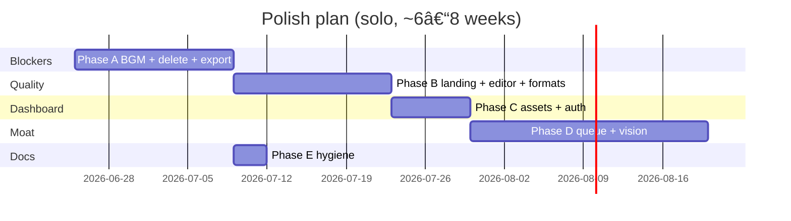

# Roadmap

Execution plan, backlog, excellence targets, and initiative history.

**See also:** [STATUS.md](./STATUS.md) (what's shipped) · [AUDIO.md](./AUDIO.md) (BGM) · [REFERENCE-MOTIONFLARE.md](./REFERENCE-MOTIONFLARE.md)

---

# Part 1 — Polish plan (active)


**Purpose:** Actionable plan to finish **partial (`[~]`)** features and raise quality from “works locally” to **production-ready**. Execute phases in order; each phase has exit criteria before moving on.

**Related:** [ROADMAP.md](./ROADMAP.md#part-2--backlog--excellence-targets) (not built) · [STATUS.md](./STATUS.md#feature-checklist) · [STATUS.md](./STATUS.md#engineering-checklist) · [AUDIO.md](./AUDIO.md)

---

## Partial inventory

Current gaps — shipped in code but not production-grade.

| Area | Feature | Current state | Target state |
|------|---------|---------------|--------------|
| **Workflow** | End-to-end < 20 min | Needs Postgres + MinIO + FFmpeg locally | Documented one-command or hosted staging env |
| **AI** | Analyze recording | Heuristic timing | Acceptable v1 + roadmap to CV; clear UI label |
| **AI** | Feature callout preset | Schema only | Inspector control + Remotion render |
| **Brand** | Brand kit | Per-project `ArcoProject.brand` | Document as v1; optional workspace kit later |
| **Monetization** | Invoices & history | Stripe Customer Portal only | Portal linked prominently; optional in-app list |
| **Dashboard** | Usage chart | Derived from usage events | Accurate labels; hide if sparse data |
| **Dashboard** | Assets library | Mock-derived from projects | Real list of recordings + exports |
| **Dashboard** | Notifications | Derived from render status | Reliable poll + read state |
| **Auth** | Magic link | UI exists | Verify email delivery in production |
| **Auth** | OAuth | Google/GitHub in forms | E2E tested on staging |
| **Export** | 9:16 / 1:1 | Picker + preview | Confirm render crop matches preview |
| **Export** | Studio 4K + social pack | Tier advertised | QA render dimensions + batch download |
| **Audio** | BGM library | 5 IDs; **placeholder audio files** | Licensed distinct tracks — see Phase A |
| **Audio** | VO pipeline UX | API + render work | Chat step “Recording voice-over…” |
| **Infra** | Render queue | In-memory | Survives API restart (Redis or DB poll) |
| **Docs** | STATUS engineering checklist Phases 1-3 | Many unchecked | Align with reality or archive stale items |

---

## Phase A — Launch blockers (1–2 weeks)

**Goal:** Remove legal and trust risks before any public launch.

### A1. BGM — replace placeholders

| Task | Owner | Effort |
|------|-------|--------|
| Source or commission 5 licensed tracks | Product / you | 1–3 days |
| Replace MP3s in `apps/web/public/music/` + `packages/remotion/public/music/` | Eng | 2h |
| Normalize LUFS; update `durationSec` in `music-tracks.ts` | Eng | 4h |
| Fill [AUDIO.md](./AUDIO.md) per track | Product | 1h |
| QA: preview modal = export audio | Eng | 2h |

**Exit:** User hears **different** moods in picker; legal doc complete; export mix matches preview.

### A2. Delete project + slot freeing

| Task | Effort |
|------|--------|
| `DELETE /projects/:id` API + slot decrement | 4h |
| Dashboard + detail UI with confirm dialog | 4h |
| Billing copy: “Delete to free a slot” | 1h |

**Exit:** Intro user at 5/5 slots can delete one project and create another.

### A3. Export reliability

| Task | Effort |
|------|--------|
| Failed render → clear error in UI + retry | 4h |
| `consumeExport()` only on completed (verify) | 2h |
| One documented golden path QA script | 2h |

**Exit:** 3 consecutive recording + screenshot exports succeed on staging.

---

## Phase B — Perceived quality (1–2 weeks)

**Goal:** Users feel the product is *designed*, not *assembled*.

### B1. Landing & social proof

| Task | Effort |
|------|--------|
| Record before/after: raw OBS vs Arco export | 4h |
| Embed on landing hero or features section | 4h |
| 2–3 public example exports (hosted MP4) | 4h |

**Exit:** New visitor understands value in < 10 seconds without signing up.

### B2. AI honesty + fallback

| Task | Effort |
|------|--------|
| Analysis UI: “AI suggested timings” vs “detected clicks” when CV absent | 2h |
| Heuristic draft quality pass (marker spacing rules) | 1 day |
| Graceful LLM failure → heuristic (verify all paths) | 4h |

**Exit:** Recording upload never produces empty or single-scene broken draft.

### B3. Editor polish

| Task | Effort |
|------|--------|
| Feature callout in inspector + Remotion | 2–3 days |
| Scene reorder (drag) on screenshot strip | 1–2 days |
| Empty states link to create hero | 4h |
| Error toasts for upload / save / render | 4h |

**Exit:** Screenshot project: reorder 5 scenes, edit callout, export without workaround.

### B4. Format fidelity

| Task | Effort |
|------|--------|
| Verify 9:16 and 1:1 render output dimensions | 4h |
| Preview aspect ratio matches export frame | 4h |
| Studio 4K path smoke test | 4h |

**Exit:** Export at each format matches preview framing (safe margins, no letterbox surprises).

---

## Phase C — Dashboard & account completeness (1 week)

**Goal:** Dashboard data is real, not “mock-shaped.”

### C1. Assets library

| Task | Effort |
|------|--------|
| API: list user recordings + exports from S3 metadata | 1 day |
| Assets page: filter, download, “use in new project” (stretch) | 1 day |

**Exit:** Assets page shows only real uploads and completed exports.

### C2. Usage & notifications

| Task | Effort |
|------|--------|
| Usage chart: weekly exports from `UsageEvent` table | 4h |
| Hide chart when < 2 data points | 1h |
| Notifications: mark read; link to project/export | 4h |

**Exit:** Stats match Stripe + internal export count.

### C3. Auth production pass

| Task | Effort |
|------|--------|
| OAuth Google + GitHub on staging | 4h |
| Magic link email (Resend/SendGrid) | 4h |
| Document unified auth decision in [TECHNICAL.md](./TECHNICAL.md) | 2h |

**Exit:** New user can sign up via OAuth or magic link on staging without developer help.

---

## Phase D — Infrastructure & magnificent recording mode (2–3 weeks)

**Goal:** Recording path becomes the moat; infra survives real users.

### D1. Render queue persistence

| Task | Effort |
|------|--------|
| BullMQ + Redis or DB-backed job processor | 2–3 days |
| Worker health + stale job recovery | 1 day |

**Exit:** API restart does not lose queued renders.

### D2. Vision / click detection (v1)

| Task | Effort |
|------|--------|
| Extract keyframes from upload | 1 day |
| Vision API labels + timestamp alignment | 2–3 days |
| Merge with heuristic markers | 1 day |

**Exit:** Test recording: ≥3 markers align with visible UI actions (manual QA benchmark).

### D3. VO on recording mode (stretch)

| Task | Effort |
|------|--------|
| Title-card-only VO scripts from draft | 2 days |
| Reuse `VoiceTrack` + ducking | 1 day |

**Exit:** Recording project exports with optional narrator on title cards only.

---

## Phase E — Docs & checklist hygiene (2–3 days)

| Task | Effort |
|------|--------|
| Update [STATUS.md](./STATUS.md#engineering-checklist) Phases 1–4 checkboxes to match shipped code | 2h |
| Update [ROADMAP.md](./ROADMAP.md#part-3--screenshot--voice--music-initiative) baseline table | 1h |
| Sync [STATUS.md](./STATUS.md#feature-checklist) monetization rows with Stripe tiers | 1h |
| [TECHNICAL.md](./TECHNICAL.md#deploy) — staging URL + env checklist | 4h |

**Exit:** New contributor can trust docs without reading git history.

---

## Suggested schedule



Phases **A** and **E** can overlap. **B** and **C** can parallelize if two workstreams.

---

## Decision log (resolve before Phase A)

| Question | Options | Recommendation |
|----------|---------|----------------|
| BGM sourcing | Epidemic / commission / hybrid | Hybrid: 3 commissioned + 2 licensed |
| Delete project | Soft delete vs hard delete | Soft delete + S3 lifecycle optional |
| Free tier | Yes for PH launch vs paid-only | Paid-only until support load is known |
| Render queue | Redis vs Postgres poll | Redis if already on Railway/Fly; else DB poll |

Record choices in [DECISIONS.md](./DECISIONS.md).

---

## Success metrics

| Phase | Metric |
|-------|--------|
| A | 0 placeholder audio in production; delete frees slot |
| B | Landing demo CTR +20% vs static hero (measure post-ship) |
| B | Screenshot reorder used in >30% of screenshot projects (beta) |
| C | OAuth signup completes without support ticket |
| D | Render job survival after deploy = 100% |
| D | Marker alignment satisfaction ≥4/5 in beta survey |

---

## What NOT to polish yet

Defer until Phases A–C pass:

- Workspace-level brand kit
- Figma / AE integrations
- Freeform keyframes
- Team seats
- URL-only video generation

See [ROADMAP.md](./ROADMAP.md#part-2--backlog--excellence-targets) for full list.

---

*Last updated: June 2026*

---

# Part 2 — Backlog & excellence targets


**Purpose:** Single source for what Arco does **not** ship yet, what would make the product **magnificent** (not just functional), and production blockers including **BGM licensing**.

**Related:** [STATUS.md](./STATUS.md#feature-checklist) (shipped vs partial) · [ROADMAP.md](./ROADMAP.md#part-1--polish-plan-active) (how to finish partial work) · [AUDIO.md](./AUDIO.md) · [STATUS.md](./STATUS.md)

**Status key:** `[ ]` not built · `[~]` partial · `[-]` explicitly out of scope

---

## How to read this doc

| Section | Use when |
|---------|----------|
| [Not built yet](#not-built-yet) | Scoping the next sprint or answering “what’s missing?” |
| [Magnificent product](#what-would-make-arco-magnificent) | Raising the quality bar beyond MVP |
| [BGM & audio](#bgm--audio-excellence) | Preparing for public launch (legal + perceived quality) |
| [Post-MVP](#post-mvp--integrations) | Month 2+ bets |

---

## Not built yet

### Project creation & lifecycle

| | Feature | Notes |
|---|---------|-------|
| [ ] | Target audience picker (founders, PMM, devtools, etc.) | Would improve AI draft tone |
| [ ] | Tone picker — minimal, bold, technical | Partially inferred from URL scrape today |
| [ ] | Target length — 15s / 30s / 60s / 90s | AI uses heuristics; no explicit user control |
| [ ] | Delete project | Billing uses project slots; delete should free a slot |
| [ ] | Duplicate project | Fast iteration for A/B exports |
| [ ] | Recording library — re-use upload across projects | Assets page is mock-derived |
| [ ] | Assets page (real library) | List recordings, exports, brand assets |

### AI & analysis (recording mode)

| | Feature | Notes |
|---|---------|-------|
| [ ] | Real click & cursor detection (CV) | Today: duration/heuristic markers only |
| [ ] | Pause & navigation-change detection | Week 5+ in original MVP plan |
| [ ] | Vision — label screens in recording | “Login”, “Dashboard”, “Settings” |
| [ ] | Sync narrative after manual scene edits | Chat/draft can drift from timeline |
| [ ] | Hybrid recording + screenshot B-roll | Phase 5 — insert image scenes between clips |
| [ ] | VO on recording-mode projects | VO ships for screenshot mode only |

### Editor & motion

| | Feature | Notes |
|---|---------|-------|
| [ ] | Feature callout (text + pointer) | Schema exists; not in inspector |
| [ ] | Reorder scenes (drag) | Add/delete exists |
| [ ] | Split scene | |
| [ ] | Merge scenes | |
| [ ] | Intro card (logo + headline from URL) | Post-MVP polish |
| [ ] | Outro / CTA card | Post-MVP polish |
| [-] | Freeform keyframes | After Effects depth — post-MVP |
| [-] | Layer timeline | Post-MVP |

### Auth & account

| | Feature | Notes |
|---|---------|-------|
| [ ] | Password auth | Magic link + OAuth UI exist |
| [ ] | OAuth fully wired end-to-end | Google/GitHub scaffolded; verify production flow |
| [ ] | Unified web + API auth | Split NextAuth (web) + JWT (API) today |
| [ ] | Email verification | |
| [ ] | Workspace switcher (real multi-tenant) | UI shell only |

### Monetization & growth

| | Feature | Notes |
|---|---------|-------|
| [ ] | Free tier (1 export/mo or similar) | Intro $9 is entry paid tier today |
| [ ] | Before/after demo on landing | Strongest conversion asset |
| [ ] | Public example exports / gallery | Social proof |
| [ ] | Product Hunt launch kit | Assets, copy, video |
| [ ] | Invoices in-app (beyond Stripe portal) | Portal works; no first-party history UI |

### Infrastructure & ops

| | Feature | Notes |
|---|---------|-------|
| [ ] | One-click deploy checklist complete | See [TECHNICAL.md](./TECHNICAL.md#deploy) |
| [ ] | Render queue persistence (Redis/Bull) | In-memory processor today |
| [ ] | 4K render path fully QA’d | Studio tier advertised |
| [ ] | Social format pack batch export | Studio tier — verify end-to-end |
| [ ] | E2E test suite for create → export | Manual QA only |

### Post-MVP / integrations

| | Feature | When |
|---|---------|------|
| [ ] | Figma frame import | Month 2+ |
| [ ] | After Effects export plugin | Phase 2 integrations |
| [ ] | GitHub release → auto video | Month 6+ |
| [ ] | URL-only storyboard (no recording/screenshots) | Out of MVP — AI fake UI risk |
| [-] | Text-to-video / fake UI generation | Out of scope per [DECISIONS.md](./DECISIONS.md) |
| [-] | AI-generated music | Out of scope — license real tracks |

---

## What would make Arco magnificent

These are not “checkbox features” — they define whether users say *“this feels premium”* vs *“this is a prototype.”*

### 1. Output quality bar (95% rule)

From [DECISIONS.md](./DECISIONS.md): if export quality is not **95% launch-ready**, users leave for CapCut or an agency.

| Target | Why it matters |
|--------|----------------|
| Markers land on real UI moments | Heuristic timing feels random; CV fixes trust |
| Transitions never feel abrupt | Default easing + min scene duration |
| Text readable at 1080p and 9:16 | Safe margins, contrast, max line length |
| Logo/brand never clipped or pixelated | Vector/SVG preferred; min resolution rules |
| First export succeeds without support | Clear errors, retry, infra docs |

**Magnificent moment:** User uploads a messy 3-minute OBS recording → Arco finds 5 beats → export looks like a Linear launch video in under 20 minutes.

### 2. Create flow — Motionflare speed, Arco authenticity

| Borrow (UX) | Keep (differentiator) |
|-------------|----------------------|
| BGM modal with preview + mood tags | Real recordings & screenshots, not AI fake UI |
| Pipeline chat with step labels | Unlimited draft/regen within subscription |
| Example chips + template strip | Editable project, not one-shot MP4 |
| Language & Voice picker | ElevenLabs quality bar |

**Magnificent moment:** Dashboard → URL + brief + screenshots → pick voice + BGM → **Make video** → preview in browser before export feels inevitable, not surprising.

### 3. Editor — Canva depth, not After Effects anxiety

| Target | Status |
|--------|--------|
| Every control maps to visible preview change | Mostly there |
| Camera focus box feels tactile | Shipped |
| Regenerate copy per scene without losing timing | Shipped |
| Scene strip shows story arc at a glance | Partial for screenshots |
| Undo/redo for destructive edits | Not built |

**Magnificent moment:** Non-designer founder tweaks headline, zoom strength, and transition — never opens a timeline with 40 layers.

### 4. Brand intelligence

| Target | Status |
|--------|--------|
| URL → colors + logo + tone | Shipped |
| Brand kit persists and applies on regen | Per-project today |
| Workspace-level brand kit | Not built |
| OG/marketing copy informs scene headlines | Partial |

**Magnificent moment:** Paste `linear.app` → draft already *feels* like that brand without manual color picking.

### 5. Audio as emotion engine

Music and voice are half the “premium” perception. See [BGM & audio excellence](#bgm--audio-excellence) below.

### 6. Trust & polish on the surface

| Item | Impact |
|------|--------|
| Landing before/after (real Arco output) | Conversion |
| Licensed music (legal + varied) | Trust + variety |
| Consistent empty/error states | Retention |
| Export progress with stage labels | Reduces anxiety |
| Delete project + slot clarity | Billing trust |

### 7. Solo-founder positioning (June 2026)

Marketing refocused on indie hackers and solo product owners — documentation and defaults should match:

- No team seats noise in UX
- Fast path: one recording or 5 screenshots → one great 30–45s video
- Pricing clarity: project slots + unlimited re-exports

---

## BGM & audio excellence

**Current state:** UI and render pipeline support 5 tracks + custom upload (Pro). **All library files are development placeholders** — same underlying sine bed copied under different names. **Do not ship publicly without replacement.**

Full asset table: [AUDIO.md](./AUDIO.md)

### Why BGM blocks “magnificent”

| Problem today | User perception |
|---------------|-----------------|
| All tracks sound identical | Picker is cosmetic |
| No loudness normalization | Some exports feel quiet/loud vs VO |
| Placeholder timbre | “Cheap template app” |
| No license paper trail | Legal risk at scale |

### Target library (production)

Match Motionflare-grade variety — **6–10 distinct licensed beds**:

| Track ID | Mood | Duration target | Use case |
|----------|------|-----------------|----------|
| `modern-saas` | UPBEAT | 60–90s | Default Product Hunt / launch |
| `ambient-tech` | STEADY | 90–120s | Dev tools, calm walkthrough |
| `corporate-clean` | BRIGHT | 60–90s | Enterprise, trustworthy |
| `startup-launch` | WARM | 60–90s | Friendly indie / SaaS |
| `energetic-reveal` | DRIVING | 45–75s | Feature drop, high energy |
| `calm-focus` *(new)* | STEADY | 90–120s | Longer tutorials |
| `cinematic-rise` *(new)* | CINEMATIC | 75–90s | Dramatic reveal |

**Optional stretch:** `up-bit` style short punchy bed (45–60s) for social cuts.

### Sourcing plan

| Option | Pros | Cons |
|--------|------|------|
| Epidemic Sound / Artlist subscription | Fast, commercial-safe, large catalog | Recurring cost; attribution rules |
| Uppbeat / Pixabay (royalty-free) | Free–low cost | Attribution; quality variance |
| Commission 5 original beds | Unique sound; full ownership | Upfront cost; time |
| Hybrid | 5 commissioned + 3 licensed | Best brand fit | Most ops |

**Recommendation:** Commission or license **5 unique beds** for launch; expand to 10 post-launch. Document every file in [AUDIO.md](./AUDIO.md).

### Technical checklist (when real assets arrive)

- [ ] Replace files in `apps/web/public/music/` and `packages/remotion/public/music/` (keep IDs stable)
- [ ] Normalize to **-14 LUFS** (integrated) across all tracks
- [ ] Trim loops: clean intro (no fade-in pop) + loop-friendly tail or hard end at 90s
- [ ] Update `durationSec` in [`music-tracks.ts`](../apps/web/src/lib/editor/music-tracks.ts)
- [ ] Verify `MusicBed` + `VoiceTrack` ducking (-12dB under speech) with each track
- [ ] Preview in BGM modal matches export (same file path)
- [ ] Custom upload: validate MIME, 10MB cap, Pro gate — already shipped; QA with real WAV
- [ ] Add `GET /music/tracks` if metadata moves server-side (optional)

### Voice (screenshot mode — shipped, excellence targets)

| Target | Status |
|--------|--------|
| ElevenLabs per-scene TTS | Shipped |
| BGM ducking under VO | Shipped |
| Pipeline step “Recording voice-over…” in chat | Not built (stretch) |
| VO on recording-mode title cards | Not built |
| TTS character usage in billing/usage UI | Partial |
| Voice preview on create | Shipped |

### Audio mix standards (export)

| Rule | Value |
|------|-------|
| BGM integrated loudness | -14 to -16 LUFS |
| Duck under VO | ~-12 dB relative |
| Peak limiter | -1 dBTP |
| Fade out last 1–2s | Avoid abrupt cut |

Document mix decisions in [AUDIO.md](./AUDIO.md) when implemented in Remotion.

---

## Priority order (backlog)

What to build **after** partial items in [ROADMAP.md](./ROADMAP.md#part-1--polish-plan-active) are addressed:

1. **Licensed BGM assets** — highest leverage for perceived quality; legal blocker for launch
2. **Delete project** — unlocks project-slot billing trust
3. **Landing before/after demo** — conversion
4. **Vision / click detection** — recording mode quality moat
5. **Scene reorder (drag)** — editor completeness
6. **Hybrid mode** — recording + screenshot B-roll
7. **VO on recording mode** — optional stretch
8. **Free tier** — funnel (if GTM requires)

---

## Definition: “magnificent” launch ready

All must be true:

- [ ] Library BGM: 5+ **distinct**, **licensed** tracks with documented sources
- [ ] Screenshot path: brief → storyboard → VO → export < 10 min for new user
- [ ] Recording path: upload → sensible markers → export without manual fix of every scene
- [ ] Landing shows real before/after from Arco (not stock)
- [ ] Delete project works; slots and billing copy match behavior
- [ ] First export success rate > 90% in beta (infra + error handling)
- [ ] Output side-by-side beats CapCut static slideshow on same screenshots (5s test)

---

*Last updated: June 2026*

---

# Part 3 — Screenshot / voice / music initiative

**Status (June 2026):** Phases 1–4 shipped. Phase 5 (hybrid) remains.

## Dual creation modes

| Mode | Visual source | Arco advantage |
|------|---------------|----------------|
| **Recording** (shipped) | User MP4 screen capture | Authentic, editable demo of *their* product |
| **Screenshots** (shipped) | 3–10 uploaded PNGs/JPGs | No recorder needed; fast static UI tours |
| **Hybrid** (planned) | Recording + screenshot B-roll | Best of both |

## Shipped capabilities

- Schema v2: `projectMode`, `scenes[]`, `audio.voiceId`, `customMusicSrc`
- `POST /uploads/image`, `POST /ai/generate-storyboard`, `POST /voice/generate`
- Dashboard Screenshots tab, BGM modal, Language & Voice picker
- Remotion: `RecordingLayer` + `ScreenshotStoryboard` + `VoiceTrack` + `MusicBed`
- Custom music upload (Pro): `POST /uploads/music`

## Phase 5 — Hybrid & polish (not shipped)

| Feature | Notes |
|---------|-------|
| Recording + screenshot B-roll | Insert image scenes between recording segments |
| URL-only prefill | Scrape → suggest screenshot order from marketing page |
| Screen text language | Separate from VO language (i18n) |
| Vision labels on screenshots | Smarter copy from screen content |
| Pipeline chat step | "Recording voice-over…" during TTS |

## Schema v2 (reference)

```typescript
type ArcoProject = {
  version: "1" | "2";
  projectMode: "recording" | "screenshots";
  recording?: { src: string; durationMs: number };
  markers?: Marker[];
  scenes?: ScreenshotScene[];
  meta, brand, audio, brief, template, stylePreset, exportFormat
};

type ScreenshotScene = {
  id: string; imageSrc: string; durationMs: number;
  headline?: string; subheadline?: string;
  voScript?: string; voAudioSrc?: string;
  transition?: { type: TransitionType };
  motion?: "ken-burns-in" | "ken-burns-out" | "pan-left" | "static";
};

type ArcoProjectAudio = {
  musicId?: string; customMusicSrc?: string; volume?: number;
  voiceId?: string; voiceLanguage?: string;
  screenTextLanguage?: string; duckUnderVoice?: boolean;
};
```

## Billing alignment (vs Motionflare)

| Action | Counts toward export allowance? |
|--------|--------------------------------|
| Create, upload, analyze, draft, chat, regen | **No** |
| In-browser preview | **No** |
| Failed export render | **No** |
| **Successful MP4 export** | **Yes** (1 slot) |

Arco meters **active project slots** per plan; unlimited re-exports per project.

## Success metrics by phase

| Phase | Metric |
|-------|--------|
| 1 (screenshots) | Time to first screenshot MP4 < 5 min |
| 2 (BGM) | >80% exports use non-default BGM |
| 3 (voice) | VO sync drift < 200ms |
| 4 (custom music) | Adoption among Pro users |
| 5 (hybrid) | Hybrid projects ≥15% of creates |

---

# Appendix — Original MVP week plan


**Goal (8/10 MVP):** Upload web app screen recording → add/edit markers → apply zoom + ripple + title presets → preview → export 16:9 MP4.

**Timeline:** ~4–6 weeks solo.

## Week 1 — Project model + preview ✅ START HERE

| Task | Package | Status |
|------|---------|--------|
| `ArcoProject` Zod schema | `@arco/project-schema` | Scaffolded |
| Remotion composition | `@arco/remotion` | Scaffolded |
| 3 presets: zoom, ripple, title-card | `@arco/remotion` | Scaffolded |
| Golden sample project JSON | `@arco/remotion` | Scaffolded |
| Remotion Studio | `pnpm --filter @arco/remotion dev` | Ready |

**Exit:** `golden-project.json` previews in Remotion Studio.

## Week 2 — Upload + marker editor

| Task | Where |
|------|-------|
| Upload MP4 (local/S3) | `apps/web` |
| Timeline UI — add marker at timestamp | `apps/web` |
| Sidebar — preset, intensity, callout text | `apps/web` |
| Wire `@remotion/player` preview | `apps/web` |

**Exit:** User uploads recording, places 3 markers, previews live.

## Week 3 — Render + persistence

| Task | Where |
|------|-------|
| Project CRUD (SQLite or Postgres) | `apps/api` or web |
| Render job → `renderMedia()` | `@arco/remotion` worker |
| Music bed (1 track) | `@arco/remotion` |
| Download MP4 | `apps/web` |

**Exit:** Upload → edit → MP4 without CLI.

## Week 4 — Ship

| Task | Where |
|------|-------|
| Landing before/after demo | `apps/web` |
| Founding Stripe ($29–49) | `apps/web` |
| 5 beta users (hackathon + founders) | GTM |
| Render progress UI | `apps/web` |

## Week 5–6 (stretch)

- AI click/pause detection → auto markers
- 9:16 export crop
- Intro card (logo + headline from URL)
- Free tier: 1 export/mo

## Explicitly NOT in MVP

- Perfect click AI (manual markers OK v1)
- Mobile recording pipeline
- AE / Figma plugins
- VO / avatars
- Team seats
- URL-only video (no recording)

## Architecture

```
apps/web          upload, editor, preview, export trigger
packages/
  project-schema  ArcoProject types + validation
  remotion        compositions, presets, render entry
```

## Marker model

```typescript
{
  id: "m1",
  startMs: 3000,
  durationMs: 1500,
  effects: [
    { type: "smooth-zoom", scale: 1.2 },
    { type: "click-ripple", intensity: 0.8 }
  ],
  callout: { text: "Create report" }
}
```

## Commands

```bash
pnpm install
pnpm --filter @arco/remotion dev          # Remotion Studio
pnpm --filter @arco/remotion render:sample # CLI render (needs sample video)
```

## Definition of done

1. Upload a real screen recording
2. Add ≥3 markers with zoom + ripple + title
3. Preview in browser
4. Export 1080p MP4 in < 20 min total
5. Output beats CapCut same recording in 5s side-by-side

## Related

- [TECHNICAL.md](./TECHNICAL.md#project-schema) · [TECHNICAL.md](./TECHNICAL.md) · [DECISIONS.md](./DECISIONS.md)
