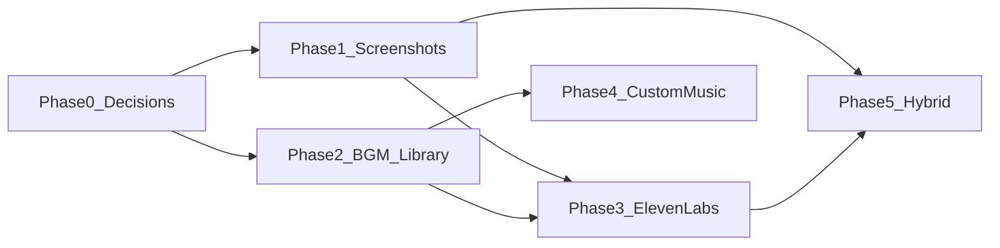

# Screenshot, voice & music roadmap

**Status:** Planning — not started (June 2026)  
**Purpose:** Deep analysis and phased plan for expanding Arco beyond **recording-first** into **screenshot storyboards**, **ElevenLabs voiceover**, and a **Motionflare-grade BGM library** (including custom upload).  
**Reference:** [Motionflare dashboard](https://motionflare.ai/dashboard) · [MOTIONFLARE-REFERENCE.md](./MOTIONFLARE-REFERENCE.md) · [MOTIONFLARE-INSPIRATION.md](./MOTIONFLARE-INSPIRATION.md)

**Related:** [AUDIO.md](./AUDIO.md) · [FEATURE-CHECKLIST.md](./FEATURE-CHECKLIST.md) · [PROJECT-SCHEMA.md](./PROJECT-SCHEMA.md) · [DECISIONS.md](./DECISIONS.md)

---

## Executive summary

Arco’s shipped core is **real screen recordings + motion presets + templates + export**. Users increasingly expect a **Motionflare-style create box**: describe the need, pick voice and music, attach visuals, get a launch video in ~60 seconds.

This roadmap adds a **second creation mode** — **Screenshot Storyboard** — without abandoning the recording differentiator:

| Mode | Visual source | Arco advantage |
|------|---------------|----------------|
| **Recording** (shipped) | User’s MP4 screen capture | Authentic, editable demo of *their* product |
| **Screenshots** (planned) | 3–10 uploaded app PNGs/JPGs | No recorder needed; fast for static UI tours |
| **Hybrid** (later) | Recording + screenshot B-roll | Best of both |

Voice (ElevenLabs) and expanded music are **cross-mode** — they apply to screenshot projects first (Motionflare parity), then optionally to recording projects.

**Do not build in one pass.** Five phases below, each shippable independently.

---

## What Motionflare does (observed)

From [motionflare.ai/dashboard](https://motionflare.ai/dashboard) (June 2026):

### Create surface

- Headline: **“What would you like to create?”**
- Tabs: **Website** · **Prompt** (Pro)
- **Product URL** input
- **Language & Voice** modal:
  - Screen text language (e.g. English, Greek)
  - Voiceover language
  - Voices with preview: Alexandra, Charles, Riley, Roger
- **BGM** modal:
  - None
  - Library: Warm Launch, Bright Pulse, Launch Drive, Calm Focus, Mountain Rise, **Up Bit**, …
  - **Upload your BGM** (Pro)
- **Make video** → project workspace

### Generation pipeline

1. Analyze product (URL scrape, screenshot, brand)
2. Draft scenes (visual + headline + VO script per scene)
3. **Record voice-over** (TTS per scene)
4. Layout + animate scenes
5. Stitch + preview + export

Motionflare visuals are **AI-generated or scraped** — not user recordings. Arco should **not** copy AI fake UI; screenshot mode uses **real user images** in device frames with Ken Burns motion.

---

## Arco today (baseline)

| Capability | State | Notes |
|------------|-------|-------|
| Dashboard quick-create | ✅ Shipped | URL + brief + recording + template strip |
| Template gallery | ✅ Shipped | 6 official templates, blueprint → draft |
| Screen recording upload | ✅ | S3, marker timeline |
| Music picker UI | ~ Partial | 5 track IDs in UI; **only `modern-saas.mp3` exists** |
| Voice / TTS | ❌ | Explicitly deferred in [AUDIO.md](./AUDIO.md) |
| Screenshot upload | ❌ | Mentioned as “B-roll later” in [PRODUCT.md](./PRODUCT.md) |
| Remotion composition | Recording-only | `RecordingLayer` — no multi-scene image stack |
| Project schema | `recording` + `markers` | No `scenes[]` with image assets + VO |

---

## Feature deep dive

### 1. Screenshot storyboard mode

**User story:** “I have 6 app screenshots and a launch brief. Make me a 45s Product Hunt video.”

**Flow:**

```
Upload 3–10 screenshots (PNG/JPG/WebP)
  + product URL (optional) + brief
  + template + BGM + voice (Phase 3+)
        ↓
AI orders screenshots → assigns duration, headlines, VO script per scene
        ↓
Remotion: device frame + pan/zoom + title overlays + transitions
        ↓
Export MP4 (16:9 / 9:16 / 1:1)
```

**Technical requirements:**

| Layer | Work |
|-------|------|
| **Schema** | New `projectMode: "recording" \| "screenshots"`; `scenes[]` with `imageSrc`, `durationMs`, `headline`, `subheadline`, `voScript?`, `voAudioSrc?` |
| **Upload API** | `POST /uploads/image` (multi), max size/count, store on S3 |
| **AI** | `POST /ai/generate-storyboard` — input: images (URLs or vision), brief, template; output: ordered scenes |
| **Remotion** | `ScreenshotSceneLayer`, `DeviceFrame`, Ken Burns, scene transitions; composition switches on `projectMode` |
| **Editor** | Scene strip (reorder), per-scene text edit, replace image; reuse chat panel |
| **Dashboard** | New tab: **Screenshots** alongside recording create |

**Differentiation vs Motionflare:** Scenes show **user’s actual UI**, not generated mockups. Optional URL scrape still fills brand + copy tone.

**Risks:**

- Variable screenshot aspect ratios → normalize in device frame
- No motion within screenshot (static) → Ken Burns + text animation must carry energy
- Vision API cost if we analyze screenshot content

---

### 2. BGM library (Motionflare-style)

**User story:** “Pick Up Bit-style upbeat music or preview tracks before I generate.”

**Observed Motionflare library (reference):**

| Track | Mood tag | ~Duration |
|-------|----------|-----------|
| Warm Launch | WARM | 1:16 |
| Bright Pulse | BRIGHT | 1:05 |
| Launch Drive | DRIVING | 1:11 |
| Calm Focus | STEADY | 1:57 |
| Mountain Rise | CINEMATIC | 1:26 |
| Up Bit | UPBEAT | 1:07 |

**Arco UI today:** [`music-tracks.ts`](../apps/web/src/lib/editor/music-tracks.ts) lists 5 moods; [`customize-panel`](../apps/web/src/components/editor/customize-panel.tsx) picker works; **assets missing**.

**Technical requirements:**

| Layer | Work |
|-------|------|
| **Assets** | Licensed MP3/WAV in `packages/remotion/public/music/` + `apps/web/public/music/` |
| **Metadata** | `MusicTrack`: id, label, mood, durationMs, previewUrl, licenseRef |
| **UI** | BGM modal on dashboard create (like Motionflare): None, library grid, play preview |
| **Render** | `MusicBed` resolves track by id; normalize LUFS (~-14 to -16) |
| **Custom upload** | Phase 4: S3 upload, `audio.customMusicSrc`, rights checkbox |

**Blocker:** **Music licensing** — cannot ship library without commercial-use rights. See [Prerequisites](#prerequisites-before-implementation).

---

### 3. ElevenLabs voiceover

**User story:** “Narrated launch video like Motionflare — pick Riley, English, spoken script per scene.”

**Observed Motionflare:** Separate **screen text language** vs **voiceover language**; 4+ voices with sample playback.

**Pipeline:**

```
Draft scenes with voScript per scene
        ↓
POST /voice/generate (ElevenLabs) — per scene or batched
        ↓
Store MP3 on S3 → scene.voAudioSrc
        ↓
Remotion: <Audio> per scene at startMs; duck BGM under VO
        ↓
Export with mixed audio
```

**Technical requirements:**

| Layer | Work |
|-------|------|
| **API module** | `apps/api/src/voice/` — ElevenLabs client, job queue, error retry |
| **Schema** | `audio.voiceId`, `audio.voiceLanguage`, `scene.voScript`, `scene.voAudioSrc`, `scene.voDurationMs` |
| **AI draft** | LLM outputs `voScript` + `callout.text` (can differ — VO spoken, text on screen shorter) |
| **UI** | Language & Voice modal on create; voice preview samples |
| **Render** | Multi-track audio graph: BGM bed + sequenced VO clips; ducking (-12dB under speech) |
| **Billing** | TTS characters ≈ cost — consider credit multiplier per voiced export |

**Why Phase 3, not Phase 1:** Adds latency (~30–60s), API cost, sync complexity, and quality bar (bad VO hurts brand).

**Reference:** Motionflare step “Recording voice-over (~40s)” in [MOTIONFLARE-REFERENCE.md](./MOTIONFLARE-REFERENCE.md).

---

### 4. Dashboard UX unification

Target create surface (combines shipped templates + new modes):

```
┌─────────────────────────────────────────────────────────┐
│  What would you like to create?                          │
│  [ Recording ] [ Screenshots ] [ Website+Recording ]     │
│  URL · Brief textarea                                    │
│  [ Attach recording ] or [ Upload screenshots ]          │
│  [ Language & Voice ] [ BGM: Up Bit ▾ ]  [ Make video ]  │
│  Template strip · Example chips                          │
└─────────────────────────────────────────────────────────┘
```

**Recording tab** — largely shipped (`DashboardCreateHero`).  
**Screenshots tab** — Phase 1.  
**Website + Recording** — optional alias of recording tab with URL required.

---

## Architecture impact

### Project model evolution

Today (`ArcoProject` v1): `recording` + `markers[]`.

Proposed v2 (dual mode):

```typescript
type ArcoProject = {
  version: "1" | "2";
  projectMode: "recording" | "screenshots";
  // Recording mode (unchanged)
  recording?: { src: string; durationMs: number };
  markers?: Marker[];
  // Screenshot mode
  scenes?: ScreenshotScene[];
  // Shared
  meta, brand, audio, brief, template, stylePreset, exportFormat
};

type ScreenshotScene = {
  id: string;
  imageSrc: string;
  durationMs: number;
  headline?: string;
  subheadline?: string;
  voScript?: string;
  voAudioSrc?: string;
  transition?: { type: TransitionType };
  motion?: "ken-burns-in" | "ken-burns-out" | "pan-left" | "static";
};

type ArcoProjectAudio = {
  musicId?: string;
  customMusicSrc?: string;
  volume?: number;
  voiceId?: string;
  voiceLanguage?: string;
  screenTextLanguage?: string;
  duckUnderVoice?: boolean;
};
```

Migration: existing projects default `projectMode: "recording"`. v1 parser remains valid.

### Remotion

| Component | Mode |
|-----------|------|
| `RecordingLayer` | recording |
| `ScreenshotStoryboard` (new) | screenshots |
| `MusicBed` | both |
| `VoiceTrack` (new) | both when VO present |
| `TitleCard`, `LogoOverlay` | both |

`ArcoComposition` branches on `projectMode`.

### API surface (new)

| Endpoint | Phase |
|----------|-------|
| `POST /uploads/image` | 1 |
| `POST /ai/generate-storyboard` | 1 |
| `GET /music/tracks` | 2 |
| `POST /uploads/music` | 4 |
| `POST /voice/generate` | 3 |
| `POST /voice/preview` | 3 |

---

## Phased roadmap

### Phase 0 — Decisions & assets (1–3 days, **you**)

**Goal:** Unblock engineering. No code.

| Deliverable | Owner |
|-------------|-------|
| Confirm **screenshots-only v1** vs dual tab vs hybrid | Product |
| Voice in Phase 3 OK, or must ship with screenshots? | Product |
| Target length (30s / 45s / 60s) and max screenshot count | Product |
| ElevenLabs account + API key + voice shortlist | You |
| 6–10 licensed music files OR approve royalty-free sourcing | You |
| 1 gold-standard example (screenshots + desired output) | You |

**Exit:** Decisions doc updated; assets in shared folder or licenses documented.

---

### Phase 1 — Screenshot storyboard (no voice) (~2 weeks)

**Goal:** Upload screenshots + brief → AI storyboard → preview → export MP4 with text + BGM.

| Task | Package / area |
|------|----------------|
| `projectMode` + `ScreenshotScene` schema | `@arco/project-schema` |
| Image upload to S3 | `apps/api` uploads |
| `generate-storyboard` AI (LLM + optional vision) | `apps/api` ai |
| Dashboard **Screenshots** tab | `apps/web` |
| Remotion screenshot composition | `@arco/remotion` |
| Editor: scene list for screenshot projects | `apps/web` editor |
| Templates apply to screenshot pacing | existing templates |

**Exit criteria:**

- [ ] 5 screenshots + brief → 30–45s MP4 with headlines and existing `modern-saas` music
- [ ] Preview in browser; export 1080p
- [ ] Project persists; re-open works

**Not in Phase 1:** Voice, custom music upload, recording+screenshot mix.

---

### Phase 2 — BGM library (~1 week)

**Goal:** Motionflare-style music picker with previews on create + customize.

| Task | Area |
|------|------|
| Ship 6+ licensed MP3 assets | `public/music`, remotion |
| `MusicTrack` metadata + `GET /music/tracks` | API + schema |
| BGM modal on dashboard (play preview, mood tags) | `apps/web` |
| Wire all tracks in render + preview | `@arco/remotion` |
| Document licenses | `docs/LICENSES-MUSIC.md` |

**Exit criteria:**

- [ ] User selects “Upbeat”-style track at create; hears preview; export contains that track
- [ ] All library tracks normalized loudness

---

### Phase 3 — ElevenLabs voiceover (~2–3 weeks)

**Goal:** Per-scene TTS, mixed export, Language & Voice on create.

| Task | Area |
|------|------|
| `apps/api/src/voice/` ElevenLabs integration | API |
| Scene `voScript` in AI storyboard + recording marker draft | AI |
| Voice picker UI + sample playback | Web |
| `VoiceTrack` in Remotion; BGM ducking | Remotion |
| Pipeline step in chat: “Recording voice-over…” | Editor |
| Usage/credits for TTS characters | Billing |

**Exit criteria:**

- [ ] Screenshot project exports with audible narration synced to scenes
- [ ] User can change voice before generate
- [ ] Mute VO option (music + text only)

**Optional stretch:** VO on recording-mode title cards only (simpler than full scene VO).

---

### Phase 4 — Custom music upload (~1 week)

**Goal:** Pro users upload own BGM (Motionflare Pro parity).

| Task | Area |
|------|------|
| `POST /uploads/music` with validation (MP3/WAV, max 10MB) | API |
| Rights affirmation checkbox | Web |
| `audio.customMusicSrc` in project + render | Schema, Remotion |
| Pro gate | Billing |

---

### Phase 5 — Hybrid & polish (~2+ weeks)

**Goal:** Best-in-class dual-mode studio.

| Feature | Notes |
|---------|-------|
| Recording + screenshot B-roll | Insert image scenes between recording segments |
| URL-only prefill | Scrape → suggest screenshots order from marketing page |
| Screen text language | Separate from VO language (i18n) |
| Template gallery for screenshot outputs | Extend `/dashboard/templates` |
| Vision labels on screenshots | “Login screen”, “Dashboard” for smarter copy |
| Watermark / credit tiers | GTM — Arco uses **export allowance**, not credits ([MONETIZATION.md](./MONETIZATION.md)) |

---

## Phase dependency graph



Phases 1 and 2 can run **in parallel** after Phase 0. Phase 3 needs both 1 and 2.

---

## Prerequisites before implementation

### From product owner

1. **Mode priority** — Screenshots first, or recording + screenshots together?
2. **Voice timing** — Phase 3 acceptable, or required for launch?
3. **Languages** — English-only v1, or screen text + VO i18n?
4. **Pro gating** — Custom music, premium voices, longer videos?
5. **Max limits** — Screenshots per project (e.g. 10), max video length (e.g. 90s)

### Assets & legal

| Item | Required for |
|------|----------------|
| Licensed music files + `LICENSES-MUSIC.md` | Phase 2 |
| ElevenLabs API key + approved voice IDs | Phase 3 |
| Sample screenshot sets (5–8 PNGs) for QA | Phase 1 |
| 1–2 reference output videos | Quality bar |

### Environment variables (collect during build)

```bash
# Phase 3
ELEVENLABS_API_KEY=
ELEVENLABS_DEFAULT_VOICE_ID=

# Existing
OPENAI_API_KEY=
S3_*=
```

---

## Open decisions (resolve in Plan mode)

These were **locked** in [DECISIONS.md](./DECISIONS.md) but are **reopened** for this initiative:

| Prior decision | Proposed update |
|----------------|-----------------|
| Primary input = recording only | **Dual mode:** recording OR screenshots |
| No VO in MVP | **VO in Phase 3** for screenshot mode |
| Screenshots as v2 B-roll | **First-class screenshot storyboard** in Phase 1 |

Record final choices in DECISIONS.md when plan is approved.

---

## Success metrics by phase

| Phase | Metric |
|-------|--------|
| 1 | Time to first screenshot MP4 < 5 min; NPS vs CapCut static slideshow |
| 2 | >80% exports use non-default BGM |
| 3 | VO sync drift < 200ms; <5% regenerate rate |
| 4 | Custom upload adoption among Pro users |
| 5 | Hybrid projects ≥15% of creates |

---

## Relationship to shipped work

| Shipped (June 2026) | How it helps this roadmap |
|---------------------|---------------------------|
| Dashboard create hero | Add Screenshots tab + BGM/Voice chips |
| Template gallery + blueprints | Scene pacing + copy tone for storyboards |
| Brand from URL | Same analyze step for screenshot mode |
| Chat + regenerate | Refine storyboard scenes |
| Export worker | Extend for multi-scene audio mix |

---

## Billing alignment (cross-cutting)

Arco intentionally **does not** meter AI drafts, previews, or failed renders like Motionflare credits on scene generation.

| Action | Counts toward export allowance? |
|--------|--------------------------------|
| Create, upload, analyze, draft, chat, regen | **No** |
| In-browser preview | **No** |
| Failed export render | **No** (refund today) |
| **Successful MP4 export** | **Yes** (1 slot) |

**Code gap:** `reserveExport()` runs when a job is **queued**; target is consume on **`status: completed`**. Include in first implementation plan alongside Phase 1–2.

Full policy: [MOTIONFLARE-INSPIRATION.md](./MOTIONFLARE-INSPIRATION.md) · [MONETIZATION.md](./MONETIZATION.md).

---

## Motionflare UX to borrow (summary)

Detailed list: [MOTIONFLARE-INSPIRATION.md](./MOTIONFLARE-INSPIRATION.md).

| Borrow | Skip |
|--------|------|
| BGM modal with preview + mood tags | Credit pre-deduct on generation |
| Language & Voice modal (Phase 3) | AI-generated scene footage |
| Example brand chips on create | Vertex TTS as default (use ElevenLabs) |
| Pipeline chat steps | Firecrawl-first visuals |

---

## Next step

When ready for **Plan mode**, provide:

1. Answers to [Open decisions](#open-decisions-resolve-in-plan-mode)
2. Confirmation of **Phase 1 + 2** scope for first implementation PR (+ optional **export billing fix**)
3. Music assets or “use placeholders for dev”
4. ElevenLabs: “Phase 3” or “include in first plan”

Agent will derive a concrete file-level plan from this doc (schema → API → Remotion → dashboard → editor).

---

*Last updated: June 2026*
