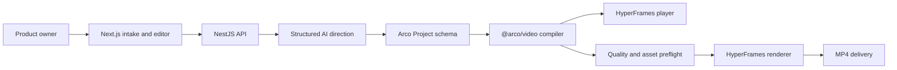

# Technical Reference

## Architecture



| Module | Responsibility |
|--------|----------------|
| `apps/web` | Intake, project UI, scene editing, review, and live preview |
| `apps/api` | Auth, projects, uploads, brand analysis, AI, voice, billing, render jobs |
| `packages/project-schema` | Runtime-validated contract shared by every process |
| `packages/hyperframes` | Composition compiler, quality checks, asset staging, and export CLI |

## Core Contract

`ArcoProject` is the source of truth. It contains:

- `meta`: title, dimensions, and frame rate.
- `brief`: intent and product URL.
- `creativeDirection`: audience, channel, tone, message, and quality notes.
- `brand`: primary color, background, and logo.
- `scenes`: real image, copy, VO, role, motion intent, layout, camera, and depth.
- `recording` and `markers`: recording source and timed focus/effect information.
- `audio`: music, voice behavior, ducking, and custom audio.
- `stylePreset`, `exportFormat`, `projectMode`, and pipeline state.

Every API input, persisted project, preview compile, and export compile should be
validated with `parseArcoProject`.

## AI Boundary

The AI layer returns structured creative intent. It can choose:

- Creative direction and core message.
- Beat role and scene order.
- Copy, voice script, and timing.
- Motion intent, layout family, camera intent, and depth.

The AI layer does not generate executable composition code. `@arco/video`
selects from authored scene systems and maps bounded project fields to HTML,
CSS, and deterministic `hf-seek` animation behavior.

This boundary is the primary defense against generic or unstable generation.

## Composition Compiler

`compileArcoVideo(project, options)`:

1. Parses the project.
2. Evaluates structural and creative quality.
3. Infers missing scene roles, layouts, cameras, depth, and transitions.
4. Builds screenshot or recording layers.
5. Adds voice, music, logo, and embedded typography.
6. Emits deterministic seek-time animation logic.
7. Returns HTML, duration, and the quality report.

The root composition declares:

- `data-composition-id`
- `data-start` and `data-duration`
- `data-width`, `data-height`, and `data-fps`
- `data-no-timeline`, because Arco owns deterministic seek behavior

Clips declare stable IDs, start, duration, and track index.

## Preview

The web editor compiles the current project in the browser and creates a Blob
URL for `<hyperframes-player>`.

The editor-facing `VideoPlayerHandle` keeps application code independent of the
player implementation:

```ts
type VideoPlayerHandle = {
  getCurrentFrame(): number;
  seekTo(frame: number): void;
};
```

Preview assets resolve from the web origin. Preview and export call the same
compiler and use the same project schema.

## Export

The API render worker writes project props and invokes:

```bash
pnpm --filter @arco/video render:file \
  --props=/absolute/project.json \
  --output=/absolute/output.mp4 \
  --public=/absolute/apps/web/public
```

`render-file.ts`:

1. Parses project props.
2. Creates the output directory.
3. Copies referenced local media and the bundled font into `assets/`.
4. Rewrites local absolute/file references to safe staged paths.
5. Compiles `index.html` with relative bundle URLs.
6. Blocks failed project quality checks.
7. Runs HyperFrames lint on the complete directory.
8. Renders high-quality MP4 with one worker, strict warnings, and no best effort.

Render bundle:

```text
render-job/
  index.html
  assets/
    fonts/
    music/
    external/
    ...project media
  output.mp4
```

The renderer is pinned to HyperFrames 0.7.64. Upgrade only with a golden-render
comparison.

## Quality Gates

Current project checks cover:

- Missing screenshot scenes and missing product assets.
- Generic AI-marketing language.
- Overlong headlines and subheadlines.
- Duplicate headlines.
- Missing role/motion intent and repeated visual choices.

HyperFrames preflight covers composition structure, font and asset references,
timeline declarations, and capture readiness.

Next quality layer:

- Rendered-frame media readiness.
- Text clipping, overlap, widows, contrast, and safe-zone checks.
- Layout/camera/transition diversity.
- Preview/export pixel comparison.
- Audio loudness, pacing, and beat alignment.
- Human-rated golden-project comparisons.

## Local Requirements

- Node.js 22 or newer.
- pnpm 10.
- FFmpeg and ffprobe on `PATH`.
- HyperFrames managed Chrome browser.
- Postgres for the API.
- S3-compatible storage for uploads and renders.

Install the renderer browser once:

```bash
pnpm --filter @arco/video exec hyperframes browser ensure
```

Useful checks:

```bash
pnpm --filter @arco/project-schema build
pnpm --filter @arco/video test
pnpm --filter @arco/video lint
pnpm --filter @arco/web exec tsc --noEmit
pnpm video:render
```

## Failure Policy

- Invalid projects fail before rendering.
- Missing local assets fail during staging.
- Lint warnings fail export.
- Media readiness warnings fail export.
- Render errors remain attached to the render job and are shown to the user.
- The server never labels a partial or fallback render as complete.

## Authentication And Storage

The NestJS API remains the authority for users, projects, and render jobs.
Access tokens are short-lived; refresh sessions are persisted and rotated.
Uploads and final renders use S3-compatible object storage. The render worker
must receive browser-readable URLs for protected remote assets or stage them
locally before compile.

## Upgrade Checklist

For changes to HyperFrames, the compiler, player, fonts, or scene systems:

1. Build the shared schema.
2. Run compiler tests and TypeScript checks.
3. Require clean HyperFrames lint.
4. Render the golden project.
5. Inspect hook, middle, transition, and CTA frames.
6. Probe codec, audio, resolution, duration, and frame rate.
7. Compare against the last approved golden output.
