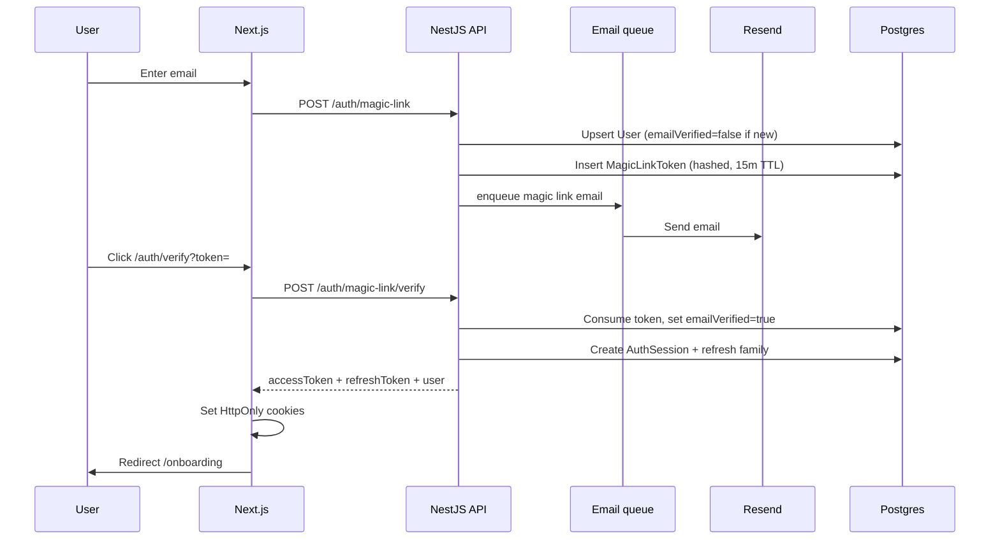
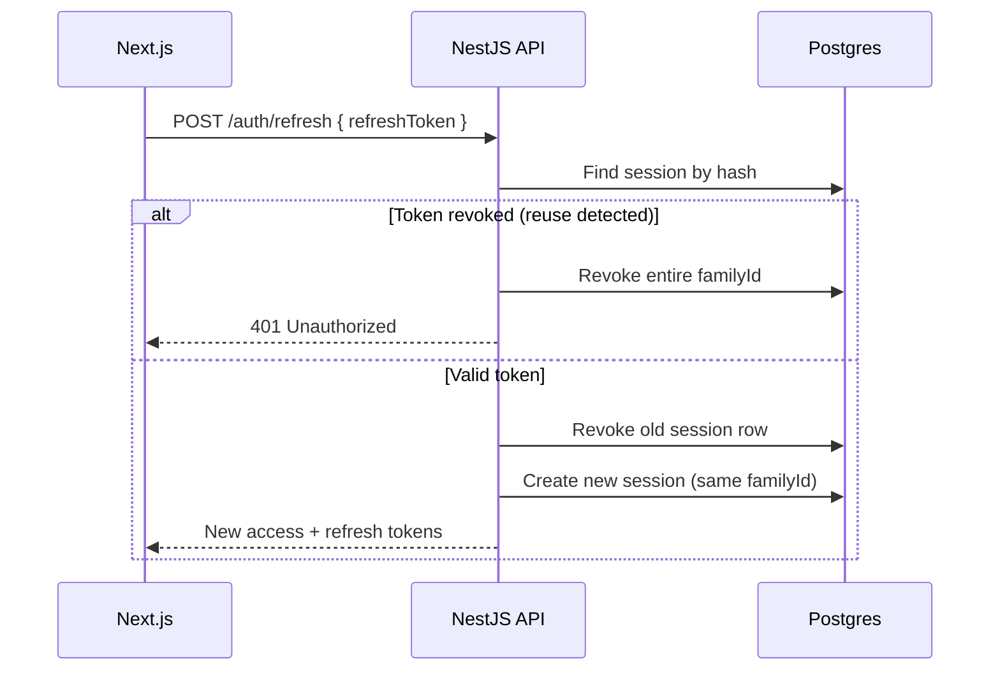
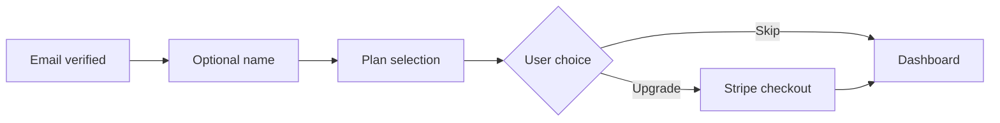
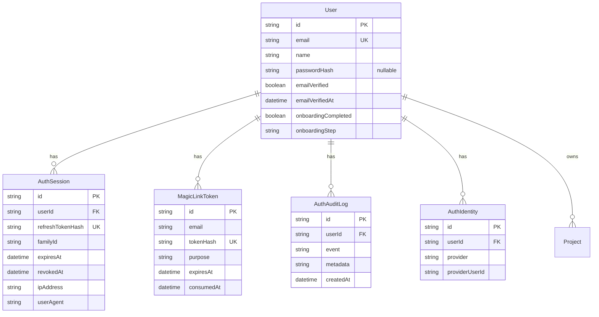

# Technical reference

Auth, deploy, schema, output spec, prompts, integrations.

**See also:** [STATUS.md](./STATUS.md) · [ROADMAP.md](./ROADMAP.md) · [AUDIO.md](./AUDIO.md)

---

# Arco Authentication Architecture

NestJS-owned authentication with mandatory email verification, passwordless magic links as the primary method, optional password fallback, JWT access tokens, rotating refresh tokens, and progressive onboarding.

## Decision summary

| Concern | Choice |
|---------|--------|
| Authority | **NestJS API** — single `User` table in Postgres |
| Primary auth | Magic link via **Resend** |
| Fallback auth | Optional password (bcrypt, 12 rounds) |
| Sessions | DB-backed refresh tokens with rotation + reuse detection |
| Web session | HttpOnly cookies set by Next.js after API token exchange |
| Access token | Stateless JWT (15 min), validated on every API request |
| Scale path | Redis-backed rate limits + email queue (interface ready) |
| SSO future | `AuthIdentity` model + `OAuthProvider` interface |

---

## Flow diagrams

### Signup / login (magic link — primary)



### Refresh token rotation



### Progressive onboarding



---

## Database schema



---

## API endpoints

Base: `http://localhost:8000/api`

### Public

| Method | Path | Body | Response |
|--------|------|------|----------|
| POST | `/auth/magic-link` | `{ email }` | `{ sent, purpose?, devVerifyUrl? }` |
| POST | `/auth/magic-link/verify` | `{ token }` | `AuthTokensResponse` |
| POST | `/auth/register` | `{ email, password }` | `{ sent, message, devVerifyUrl? }` |
| POST | `/auth/login` | `{ email, password }` | `AuthTokensResponse` |
| POST | `/auth/refresh` | `{ refreshToken }` | `AuthTokensResponse` |
| POST | `/auth/logout` | `{ refreshToken }` | `{ success }` |
| POST | `/auth/password/forgot` | `{ email }` | `{ sent, message }` |
| POST | `/auth/password/reset` | `{ token, password }` | `{ success }` |

### Authenticated (Bearer or cookie)

| Method | Path | Description |
|--------|------|-------------|
| GET | `/auth/sessions` | List active sessions |
| DELETE | `/auth/sessions/:id` | Revoke session |
| POST | `/auth/logout-all` | Revoke all other sessions |
| POST | `/auth/password/set` | Set password for magic-link-only users |
| PATCH | `/auth/onboarding` | `{ name?, step? }` |
| GET | `/users/me` | Current user profile |
| PATCH | `/users/me` | Update profile |

### AuthTokensResponse

```json
{
  "accessToken": "eyJ...",
  "refreshToken": "opaque-base64url",
  "expiresIn": 900,
  "tokenType": "Bearer",
  "user": {
    "id": "cuid",
    "email": "user@company.com",
    "name": null,
    "emailVerified": true,
    "onboardingCompleted": false,
    "onboardingStep": "plan"
  }
}
```

---

## Session and token strategy

| Token | Type | TTL | Storage | Transport |
|-------|------|-----|---------|-----------|
| Access | JWT (`sub`, `email`, `sid`, `type: access`) | 15 min | Not stored (stateless) | HttpOnly cookie + Bearer header |
| Refresh | Opaque random (SHA-256 hash in DB) | 30 days | `AuthSession` table | HttpOnly cookie |
| Magic link | Opaque random (SHA-256 hash in DB) | 15 min | `MagicLinkToken` table | Email URL only |

**Rotation:** Each refresh invalidates the previous refresh token and issues a new one within the same `familyId`. Presenting a revoked refresh token revokes the entire family (theft detection).

**Multi-device:** Each login creates a new `familyId`. Users manage devices via Settings → Security.

---

## Security

| Threat | Mitigation |
|--------|------------|
| Token theft | HttpOnly + Secure + SameSite=Lax cookies; short access TTL |
| Refresh reuse | Family revocation on reuse detection |
| Brute force | Rate limits per IP/email on magic link, login, refresh |
| User enumeration | Password reset always returns success message |
| Magic link replay | Single-use tokens, hashed at rest |
| XSS | No tokens in localStorage; access token not exposed to JS unless via server session endpoint |
| CSRF | SameSite cookies; state-changing auth uses POST + server actions |
| Suspicious login | Device fingerprint change triggers audit log + email alert |

Audit events are written asynchronously to `AuthAuditLog`.

---

## Scalability and HA

| Component | Current | Production recommendation |
|-----------|---------|---------------------------|
| Rate limiting | In-process `Map` | Redis sliding window |
| Email delivery | In-process queue (`setImmediate`) | BullMQ / SQS + Resend |
| Audit logs | Async Postgres writes | Dedicated audit table + log drain |
| JWT validation | Stateless (any API instance) | Same — no sticky sessions required |
| Refresh sessions | Postgres | Postgres + read replicas |
| Magic links | Postgres | Postgres; optional Redis for hot path |

Run multiple NestJS instances behind a load balancer. No session affinity required for access tokens. Refresh rotation uses DB transactions for correctness.

---

## Environment variables

### API (`apps/api/.env`)

```
JWT_SECRET=           # Shared with web middleware
RESEND_API_KEY=
EMAIL_FROM=Arco <hello@arco.app>
WEB_APP_URL=http://localhost:3000
DATABASE_URL=
CORS_ORIGIN=http://localhost:3000
```

### Web (`apps/web/.env.local`)

```
JWT_SECRET=           # Must match API
API_URL=http://localhost:8000/api
```

---

## Implementation map

```
apps/api/src/auth/
  auth.controller.ts       # HTTP endpoints
  auth.service.ts          # Orchestration
  services/
    token.service.ts       # JWT access tokens
    session.service.ts     # Refresh rotation
    magic-link.service.ts  # Link create/consume
    audit.service.ts       # Async audit logs
    rate-limit.service.ts  # Sliding window (Redis-ready)
    email-queue.service.ts # Async Resend delivery
  providers/
    oauth-provider.interface.ts  # Future SSO
```

```
apps/web/src/lib/auth/
  cookies.ts    # HttpOnly cookie helpers
  session.ts    # getServerSession(), refresh
  constants.ts
```

---

## Onboarding UX

1. **Signup:** email only (magic link) or email + password — no name, company, or plan required
2. **Verify:** mandatory email click before session is issued
3. **Onboarding step 1:** optional name (skippable)
4. **Onboarding step 2:** plan selection — upgrade via Stripe or continue free to dashboard
5. **Profile completion:** available anytime in Settings

---

## Migration notes

- Removed NextAuth, `.data/users.json`, and dual-token bridge
- `passwordHash` is now optional on `User`
- Run `pnpm --filter @arco/api db:push` after pulling
- Existing password users must verify email if `emailVerified` is false (default for legacy rows — set manually or re-verify)

---

# Deploy


## Services

| Service | Notes |
|---------|--------|
| **Web** | Next.js 15 — `apps/web` |
| **API** | NestJS — `apps/api` |
| **Render worker** | Runs inside API process (`RenderProcessorService`) |
| **Postgres** | Prisma — `DATABASE_URL` |
| **S3** | Recordings, thumbnails, rendered MP4s |
| **Stripe** | Subscriptions + webhooks |

## Environment

Copy and fill:

- [`apps/api/.env.example`](../apps/api/.env.example)
- [`apps/web/.env.example`](../apps/web/.env.example)

Run after schema changes:

```bash
pnpm --filter @arco/api exec prisma db push
```

## Stripe setup

1. Create **Product**: Arco Pro
2. Create **Price**: $29/month recurring → set `STRIPE_PRICE_PRO_MONTHLY`
3. Create **Coupon**: $20 off once (Launch Offer → $9 first invoice) → set `STRIPE_COUPON_LAUNCH`
4. Enable **Customer Portal** in Stripe Dashboard
5. Add webhook endpoint: `https://your-api.com/api/billing/webhook`
   - Events: `checkout.session.completed`, `customer.subscription.updated`, `customer.subscription.deleted`, `invoice.paid`, `invoice.payment_failed`
6. Set `STRIPE_WEBHOOK_SECRET` from webhook signing secret

Local webhook testing:

```bash
stripe listen --forward-to localhost:8000/api/billing/webhook
```

## Build & run

```bash
pnpm install
pnpm --filter @arco/api run build
pnpm --filter @arco/web run build
```

Production:

```bash
pnpm --filter @arco/api run start:prod
pnpm --filter @arco/web run start
```

## FFmpeg

Remotion render requires **FFmpeg** on the API host PATH.

## Paid-only model

- New users register with `planStatus: inactive`
- Dashboard/editor blocked until Stripe checkout completes
- Launch Offer: $9 first month via coupon, then $29/mo
- Exports gated at `POST /renders` (15/month default via `EXPORT_ALLOWANCE_PRO`)

## URLs to configure

| Variable | Example |
|----------|---------|
| `STRIPE_SUCCESS_URL` | `https://app.arco.video/dashboard/billing?checkout=success` |
| `STRIPE_CANCEL_URL` | `https://app.arco.video/dashboard/billing?checkout=canceled` |
| `STRIPE_PORTAL_RETURN_URL` | `https://app.arco.video/dashboard/billing` |
| `CORS_ORIGIN` | `https://app.arco.video` |
| `API_PUBLIC_URL` | `https://api.arco.video` |

---

# Project schema


Source of truth: `packages/project-schema` — validate with Zod.

The **Arco Project** replaces the old scene-only JSON. A project includes a **recording** + **markers** + **effects**.

## ArcoProject

```typescript
type ArcoProject = {
  version: "1";
  meta: {
    title: string;
    fps: number;        // default 30
    width: number;      // default 1920
    height: number;     // default 1080
  };
  recording: {
    /** Path or URL to uploaded MP4 */
    src: string;
    durationMs: number;
  };
  markers: Marker[];
  brand?: {
    primary: string;
    background: string;
    logoSrc?: string;
  };
  audio?: {
    musicId?: string;
    volume?: number;    // 0–1, default 0.85
  };
};
```

## Marker

```typescript
type EffectType =
  | "smooth-zoom"
  | "click-ripple"
  | "title-card"
  | "spotlight"
  | "feature-callout"
  | "transition";

type MarkerEffect = {
  type: EffectType;
  scale?: number;       // smooth-zoom, default 1.2
  intensity?: number;   // ripple/spotlight 0–1
};

type Marker = {
  id: string;
  startMs: number;
  durationMs: number;   // default 1500
  effects: MarkerEffect[];
  callout?: {
    text: string;
    subtext?: string;
  };
};
```

## AI vs presets

- **AI (later):** proposes `markers[]` from recording analysis
- **Presets:** `effects[].type` maps to Remotion components — motion designed once

## Export settings (v2)

```typescript
type ExportSettings = {
  format: "16:9" | "9:16" | "1:1";
  includeMusic: boolean;
};
```

## Sample

See `packages/remotion/src/sample/golden-project.json`.

## Migration from scene-schema

Old `SCENE-SCHEMA.md` described URL→storyboard launch videos. v1 MVP is **recording-first**. URL/intro cards become optional `brand` + bookend markers in v2.

---

# Output specification


Quality bar for templates and QA. Creative reference: **Linear, Raycast, Vercel, Framer** launch films.

## Format

| Property | MVP value |
|----------|-----------|
| Resolution | 1920×1080 |
| FPS | 30 |
| Duration | 30s default (900 frames) |
| Codec | H.264 MP4 |
| Audio | Stereo music, -14 to -16 LUFS normalized |

## Visual

- Background: brand `#07080a` or template premium dark/light
- Typography: bold headline, restrained subcopy; positive letter-spacing on dark (see DESIGN.md)
- UI: real screenshots in device frame; slow pan/zoom; no stretched assets
- Motion: ease-out / smooth bezier; stagger 3–8 frames
- Text: burned-in callouts (hook, features, CTA)—readable at mobile size
- No stock actors in MVP

## Audio

- **Music only** — no narrator
- Track must not overpower; no clipping
- Optional template SFX in Phase 2 (whoosh on cut)—not MVP

## Story rhythm (30s example)

| Segment | ~Duration | Content |
|---------|-----------|---------|
| Intro | 3s | Logo + tagline text |
| Hook | 4s | Problem/outcome headline |
| Feature 1 | 5s | UI + callout |
| Feature 2 | 5s | UI + callout |
| Feature 3 | 5s | UI + callout |
| CTA | 4s | CTA text + logo |
| Outro | 4s | Hold / fade |

Tune per template; total frames must match `durationInFrames`.

## Text scene examples

- “Stop losing files”
- “Sync across devices”
- “Collaborate in real time”
- “Start free today”

## QA checklist

### Sprint 1 golden path (manual)

Run on local stack (Postgres + MinIO + FFmpeg + API + web):

1. **Recording** — Sign in → dashboard create hero → upload MP4 → wait for AI draft → open editor → export 16:9 → download from project detail. Repeat export twice on same project (re-export should succeed).
2. **Screenshots** — Dashboard Screenshots tab → upload 3+ images → generate storyboard → drag-reorder scenes in strip → export → confirm failed renders show `errorMessage` + **Retry export** on project detail.
3. **Billing slots** — On Intro plan at 5/5 projects → delete one from list or detail → confirm slot frees → create new project.

### Template / screenshot quality

- [ ] All headlines readable at 1080p on phone
- [ ] Screenshots sharp, correct aspect ratio
- [ ] No VO / no “AI ad” cadence
- [ ] Music fits mood; no jarring loop point
- [ ] CTA legible last 3 seconds
- [ ] Does not feel like stock slideshow
- [ ] Passes 5s comparison vs Canva/InVideo template

## Optional B-roll prompt (Phase 2 only)

If adding Runway/Veo later—never for UI:

> Cinematic studio lighting, premium neutral background, smooth slow pan, shallow DOF, professional commercial, minimal text, no people, no UI elements

UI must always come from **real screenshots**.

---

# Prompts and style


Reference for output quality and optional Phase 2 B-roll generation. **MVP does not use text-to-video for UI.**

## “Clean product promo” definition

Arco output should match modern SaaS launch aesthetic:

- Minimalist, modern, product-forward  
- Smooth camera (slow pans, close-ups, UI zoom)  
- Professional lighting on abstract backgrounds (B-roll only)  
- Neutral or premium backgrounds  
- Clear typography, subtle motion graphics  
- High-end commercial look (Apple, Samsung, luxury SaaS)  
- Short scenes emphasizing features and benefits  

## Reference brands

Linear, Raycast, Vercel, Framer — typically:

- Music bed  
- Motion graphics  
- Product UI (real)  
- Text callouts  
- **No narrator**

---

## Optional B-roll prompt (Phase 2 only)

Use for abstract segments between UI scenes. **Never** for product UI (use screenshots).

```
Create a clean, modern abstract B-roll clip for a SaaS brand.
Cinematic studio lighting, premium white or dark neutral background,
smooth slow camera pan, shallow depth of field, minimal elements,
professional commercial advertising style, 4K, seamless loop-friendly,
no people, no text, no user interface, no logos.
```

### Physical product variant (out of MVP scope)

Add: material, color, key feature macro shots.

---

## SaaS-specific content rules

| Element | Source |
|---------|--------|
| Dashboard UI | User screenshots / Figma |
| Headlines | Storyboard text scenes (LLM + user edit) |
| Logo | User upload or OG image |
| Music | Curated library ([AUDIO.md](./AUDIO.md)) |
| VO | **Not MVP** |

---

## LLM prompts (storyboard — draft)

### System intent

You write **on-screen text only** for a 30-second SaaS launch video. No voiceover script. Tone: confident, minimal, devtool/SaaS audience. No hype clichés (“revolutionary”, “game-changing”).

### User context template

```
Product URL: {url}
Title: {title}
Description: {description}
Features detected: {features}

Generate 5-7 storyboard scenes with:
- headline (max 8 words)
- optional subheadline (max 12 words)
- durationSeconds (total ~30)

Scene types: hook, feature (x3), cta.
Output JSON only matching Storyboard schema.
```

See [TECHNICAL.md](./TECHNICAL.md#legacy-scene-schema).

---

## Design system for web + video text

Video text should align with [`apps/web/DESIGN.md`](../apps/web/DESIGN.md):

- Background `#07080a` or brand kit  
- Primary text `#f9f9f9`  
- Accent `hsl(202, 100%, 67%)` (~`#55b3ff`)  
- Inter, positive letter-spacing on dark  
- Weight 500–600 for headlines  

---

## Related docs

- [TECHNICAL.md](./TECHNICAL.md#output-specification)  
- [AUDIO.md](./AUDIO.md)  
- [PRODUCT.md](./PRODUCT.md)  

---

# Integrations


## Strategy

**Arco scene JSON** is the contract. Tools export into or import from Arco—not `.aep` parsing in v1.

```
Figma / screenshots / URL
        ↓
   Storyboard (text scenes)
        ↓
   Arco scene JSON  ←── source of truth
        ↓
   Remotion + music track → MP4
        ↓ (Phase 2)
   After Effects plugin (refine)
```

## Figma (highest leverage)

**Month 1:** Manual PNG export + copy colors/text into Arco.  
**Month 2+:** Plugin exports frames → scene JSON + assets.

## After Effects (Phase 2)

Not in 30-day MVP.

1. Month 1: Export scene JSON + asset bundle
2. Month 2–3: AE plugin reads JSON → comps/layers (subset of properties)
3. Designers polish; no round-trip required

### Lottie (optional)

AE → Bodymovin → Lottie for logo stings only. Heavy effects → bake to MP4.

## Remotion

Primary renderer. Templates = React components + `scene-schema` props + `staticFile()` music.

## Audio integrations (MVP)

- **Curated local/CDN MP3/WAV** — no Spotify API, no AI music gen
- See [AUDIO.md](./AUDIO.md)

## Audio Phase 2–3 (planned)

| Phase | Integration |
|-------|-------------|
| 2 | Licensed BGM library (6+ tracks, preview modal) — [ROADMAP.md](./ROADMAP.md#part-3--screenshot--voice--music-initiative) |
| 3 | **ElevenLabs** TTS per scene, BGM ducking — not Vertex TTS ([REFERENCE-MOTIONFLARE.md](./REFERENCE-MOTIONFLARE.md#part-2--what-to-borrow-and-avoid)) |
| 4 | User-uploaded music (Pro) |

## Audio NOT in MVP

- TTS / voice (ElevenLabs in Phase 3)
- Audio sync to generated speech
- Presenter video APIs

## AI (MVP scope)

| Use | Tool |
|-----|------|
| URL → storyboard copy | LLM API |
| Optional metadata | Cheerio / fetch OG tags |

## AI NOT in MVP

- Text-to-video
- AI music
- AI voice (ElevenLabs planned Phase 3 — see [ROADMAP.md](./ROADMAP.md#part-3--screenshot--voice--music-initiative))

## Waitlist (existing)

`apps/web/src/app/actions/waitlist.ts` → `WAITLIST_WEBHOOK_URL` POST `{ email }`.

## Design system

[`apps/web/DESIGN.md`](../apps/web/DESIGN.md)

---

# Legacy scene schema


> **Superseded by [TECHNICAL.md](./TECHNICAL.md#project-schema)** — recording-first `ArcoProject` model.

# Scene schema (v1 draft — deprecated)

Contract between ingest, web app, Remotion, and future AE plugin. Validate with Zod in `packages/scene-schema`.

## Storyboard (user-facing)

Generated from URL analysis; edited in UI before render.

```typescript
type StoryboardScene = {
  id: string;
  headline: string;
  subheadline?: string;
  durationSeconds: number;
  /** Optional screenshot asset id for ui-frame scenes */
  assetId?: string;
};

type Storyboard = {
  projectId: string;
  templateId: "launch-30";
  musicId: MusicId;
  scenes: StoryboardScene[];
};

type MusicId =
  | "ambient-tech"
  | "modern-saas"
  | "corporate-clean"
  | "startup-launch"
  | "energetic-reveal";
```

**No `voiceover` field in v1.**

## Composition (render-facing)

```typescript
type Composition = {
  version: "1";
  composition: {
    width: number;
    height: number;
    fps: number;
    durationInFrames: number;
  };
  audio: {
    musicId: MusicId;
    /** 0–1, default 0.85 */
    volume?: number;
  };
  brand: {
    primary: string;
    background: string;
    logoAssetId?: string;
  };
  scenes: CompositionScene[];
};

type CompositionScene = {
  id: string;
  durationInFrames: number;
  layers: Layer[];
};

type Layer = TextLayer | ImageLayer | UiFrameLayer | SolidLayer | GroupLayer;

type TextLayer = {
  id: string;
  type: "text";
  props: {
    content: string;
    subcontent?: string;
  };
  animation: AnimationPreset;
};

type ImageLayer = {
  id: string;
  type: "image";
  props: { assetId: string };
  animation: AnimationPreset;
};

type UiFrameLayer = {
  id: string;
  type: "ui-frame";
  props: { assetId: string; device?: "browser" | "macos" };
  animation: AnimationPreset;
};

type SolidLayer = {
  id: string;
  type: "solid";
  props: { color: string };
};

type GroupLayer = {
  id: string;
  type: "group";
  children: Layer[];
};

type AnimationPreset = {
  preset:
    | "fade-in"
    | "slide-up"
    | "slide-down"
    | "scale-in"
    | "ui-pan-zoom";
  delayFrames?: number;
  durationFrames?: number;
};
```

## Transform: storyboard → composition

1. Sum `durationSeconds` → `durationInFrames` (fps × seconds).
2. Map each storyboard scene to `CompositionScene` with `text` + optional `ui-frame`.
3. Attach `audio.musicId` from storyboard.
4. Resolve `assetId` to file paths in render bundle.

## Assets manifest (sidecar)

```typescript
type AssetManifest = {
  assets: Record<
    string,
    { path: string; type: "image" | "logo"; width?: number; height?: number }
  >;
};
```

## Versioning

- Bump `version` on breaking changes.
- AE plugin (Phase 2) targets explicit `version` support list.

## Example minimal JSON

```json
{
  "version": "1",
  "composition": {
    "width": 1920,
    "height": 1080,
    "fps": 30,
    "durationInFrames": 900
  },
  "audio": { "musicId": "modern-saas", "volume": 0.85 },
  "brand": { "primary": "#55b3ff", "background": "#07080a" },
  "scenes": [
    {
      "id": "hook",
      "durationInFrames": 90,
      "layers": [
        {
          "id": "headline",
          "type": "text",
          "props": {
            "content": "Sync Everything",
            "subcontent": "Across all your devices"
          },
          "animation": { "preset": "slide-up", "delayFrames": 8 }
        }
      ]
    }
  ]
}
```
